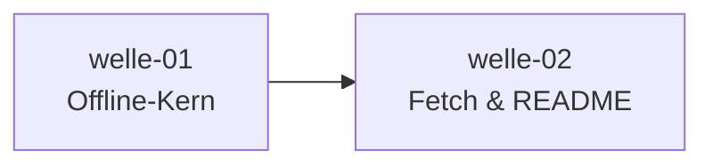

# Roadmap

**Status:** Aktiv. **Letzte Änderung:** 2026-07-19.

**Format-Regel:** Die Roadmap ist eine Reihenfolge von **Wellen**,
keine Reihenfolge von Terminen (siehe
[Kurs Modul 6](https://github.com/pt9912/ai-harness-course/blob/v3.1.0/kurs/de/02-planung/modul-06-roadmap.md)).
Termine werden — falls überhaupt — als Konsequenz der Wellen-Schätzung
gezeigt, nicht als Treiber.

---

## Aktuelle Welle

**Welle-ID:** [welle-02-fetch-und-readme](../welle-02-fetch-und-readme.md)
**Start:** 2026-07-18 (Trigger „welle-01 done" erfüllt)
**Geplantes Ende:** offen

**Closure-Trigger:** slice-004a/004b (Sprachskelett-Fetch + Verdrahten, [`LH-FA-04`](../../../../spec/lastenheft.md#lh-fa-04--sprachskelett-picker-f4)) und slice-005
(Root-README, [`LH-FA-05`](../../../../spec/lastenheft.md#lh-fa-05--root-readme-emittieren-f1-f2)) in `done/`, `make gates` grün; slice-005 bringt den
Voll-E2E-`make gates`-Smoke des Bootstraps ([`LH-QA-01`](../../../../spec/lastenheft.md#lh-qa-01--keine-halluzinierten-gates-f4-f5-f6) Happy-Path). Details in der
[welle-02-Plan-Datei](../welle-02-fetch-und-readme.md).

> **Stand (2026-07-19, nicht Teil der Wellen-Ordnung):** **Distributionsmodell-Pivot** —
> [`ADR-0005`](../../../../docs/plan/adr/0005-ziel-repo-distribution.md) (Accepted, supersedes die frühere Skelett-Fetch-ADR),
> CR [`LH-FA-04`](../../../../spec/lastenheft.md#lh-fa-04--sprachskelett-picker-f4) (Picker→deterministischer Generator) und neue
> [`LH-FA-09`](../../../../spec/lastenheft.md#lh-fa-09--regelwerk-emittieren) (Regelwerk emittieren). Das **Doc-Fundament ist fertig +
> gate-grün** (Lastenheft v0.7.0); der **Code** (embed→fetch, Skelett-Generatoren) folgt.
> Damit ist die **Layering-Vorbedingung von slice-004b gelöst** — das ADR entscheidet die
> Datei-Ownership (Generator besitzt `Makefile`/`Dockerfile`/`go.mod`, Fetch die `AGENTS.md`-Vorlage);
> slice-004b wird daraus **re-skopt**. **slice-004a** (Skelett-Fetch) in `done/`, **slice-005**
> (Root-README + Voll-Smoke) `open/`. **Nächster Schritt:** die **Umsetzungs-Welle aus dem ADR
> schneiden** (Embed raus · Fetch Regelwerk+Templates · Skelett-Generatoren · Gerüst · Init-Flow ·
> Emit-Smoke) und diese Roadmap/M2 danach nachziehen. Offene Aufräum-Punkte (kein Gate-Bruch):
> stale Links auf die superseded Skelett-Fetch-ADR in welle-02/welle-01/Root-README.

## Nächste Wellen

| Welle | Trigger | Wichtigste Slices | Geschätzter Aufwand |
|---|---|---|---|
| _(noch nicht geplant — welle-02 ist jetzt die Aktuelle Welle)_ | — | — | — |

## Meilensteine

| Meilenstein | Welle(n) | Trigger | Status |
|---|---|---|---|
| M1 — lauffähiger Offline-Kern (`cmd/ai-harness-init` parst + emittiert Gate-Baseline + legt Templates ab, ohne Netz) | welle-01 | slice-001a/001b/002/003 done | **erreicht (2026-07-18)** |
| M2 — vollständiger Bootstrap (inkl. Sprachskelett-Generator + Root-README) | welle-02 | slice-004a/004b/005 done | offen |

## Abhängigkeitsgraph

## Abgeschlossene Wellen

| Welle | Abschluss | Closure-Notiz |
|---|---|---|
| [welle-01-offline-kern](../done/welle-01-offline-kern.md) | 2026-07-18 | [welle-01-results.md](../done/welle-01-results.md) |

## Historische Trigger-Verschiebungen

| Datum | Was wurde geändert? | Warum? |
|---|---|---|
| 2026-07-18 | welle-01 geschlossen; welle-02 aktiviert; M1 erreicht | Trigger „alle welle-01-Slices `done/` + `make gates` grün" erfüllt |
| 2026-07 | welle-01-Slices auf die Go-Ära re-geschnitten (slice-001 → 001a/001b) | Impl-Sprache Go / native Binaries ([`ADR-0003`](../../../../docs/plan/adr/0003-go-native-binaries.md)); slice-001 zu groß (Modul-5-Rücksprung) |
