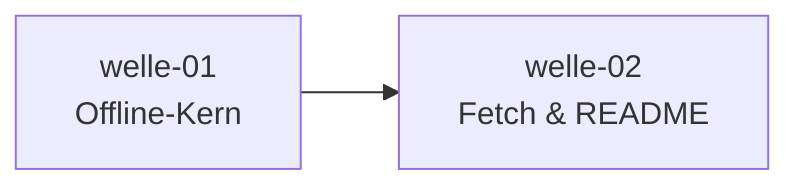

# Roadmap

**Status:** Aktiv. **Letzte Änderung:** 2026-06-13.

**Format-Regel:** Die Roadmap ist eine Reihenfolge von **Wellen**,
keine Reihenfolge von Terminen (siehe
[Kurs Modul 6](https://github.com/pt9912/ai-harness-course/blob/v3.1.0/kurs/de/02-planung/modul-06-roadmap.md)).
Termine werden — falls überhaupt — als Konsequenz der Wellen-Schätzung
gezeigt, nicht als Treiber.

---

## Aktuelle Welle

**Welle-ID:** [welle-01-offline-kern](../welle-01-offline-kern.md)
**Start:** 2026-06-13
**Geplantes Ende:** offen (Schätzung folgt mit slice-001-Closure)

**Closure-Trigger:** siehe [Welle-Datei](../welle-01-offline-kern.md) §3 —
kurz: slice-001..003 done, `make gates` grün inkl. promoteter `lint`/`test`.

## Nächste Wellen

| Welle | Trigger | Wichtigste Slices | Geschätzter Aufwand |
|---|---|---|---|
| welle-02-fetch-und-readme | welle-01 done | slice-004 Picker ([`LH-FA-04`](../../../../spec/lastenheft.md#lh-fa-04--sprachskelett-picker-f4), [`ADR-0001`](../../../../docs/plan/adr/0001-skelett-distribution.md)), slice-005 Root-README ([`LH-FA-05`](../../../../spec/lastenheft.md#lh-fa-05--root-readme-emittieren-f1-f2)) | M |

## Meilensteine

| Meilenstein | Welle(n) | Trigger | Status |
|---|---|---|---|
| M1 — lauffähiger Offline-Kern (`cmd/ai-harness-init` parst + emittiert Gate-Baseline + legt Templates ab, ohne Netz) | welle-01 | slice-001..003 done | offen |
| M2 — vollständiger Bootstrap (inkl. Sprachskelett-Picker + Root-README) | welle-02 | slice-004..005 done | offen |

## Abhängigkeitsgraph

## Abgeschlossene Wellen

| Welle | Abschluss | Closure-Notiz |
|---|---|---|
| — | — | — |

## Historische Trigger-Verschiebungen

| Datum | Was wurde geändert? | Warum? |
|---|---|---|
| — | — | — |
