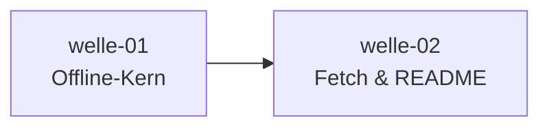

# Roadmap

**Status:** Aktiv. **Letzte Änderung:** 2026-06-13.

**Format-Regel:** Die Roadmap ist eine Reihenfolge von **Wellen**,
keine Reihenfolge von Terminen (siehe
[Kurs Modul 6](https://github.com/pt9912/ai-harness-course/blob/v3.1.0/kurs/de/02-planung/modul-06-roadmap.md)).
Termine werden — falls überhaupt — als Konsequenz der Wellen-Schätzung
gezeigt, nicht als Treiber.

---

## Aktuelle Welle

**Welle-ID:** [welle-01-offline-kern](../welle-01-offline-kern.md)
**Start:** 2026-06-13
**Geplantes Ende:** offen (Schätzung folgt mit slice-001a-Closure)

**Closure-Trigger:** siehe [Welle-Datei](../welle-01-offline-kern.md) §3 —
kurz: slice-001a/001b/002/003 done, `make gates` grün inkl. der in slice-001b promoteten
Go-Gates `build`/`lint`.

> **Kontext (Stand 2026-07-18, nicht Teil der Wellen-Ordnung):** welle-01 hat noch
> nicht begonnen — ihre Slices (001..003) sind gerade auf die **Go-Ära** geschnitten
> (`cmd/`, Go-Gates; [`ADR-0003`](../../../../docs/plan/adr/0003-go-native-binaries.md)). Parallel lief der **Harness-Wartungs-Zug** slice-006..014
> (`ohne Welle`, alle `done/`): Repo auf Baseline **v3.1.0** (vendored, [`MR-007`](../../../../harness/conventions.md#mr-007--baseline-committet-vendored-statt-gefetchter-cache)),
> Templates referenziert ([`MR-008`](../../../../harness/conventions.md#mr-008--ausfüll-templates-referenziert-statt-kopiert)). **slice-016** (d-check-Pin v0.46.0 +
> `codepaths`-Ventile, [`MR-009`](../../../../harness/conventions.md#mr-009--d-check-pin-sprung-und-codepath-ventile)) ist **`done/`**. Startbereit in `open/`: **slice-001a**
> (CLI-Fundament, re-sliced aus slice-001) und **slice-001b** (Go-Gates build/lint, hängt an 001a).
> slice-017 (`d-check.mk`) und slice-018 (Freshness-Sensor) sind seither `done/`; `slice-015`
> bleibt blockiert.

## Nächste Wellen

| Welle | Trigger | Wichtigste Slices | Geschätzter Aufwand |
|---|---|---|---|
| welle-02-fetch-und-readme | welle-01 done | slice-004 Picker ([`LH-FA-04`](../../../../spec/lastenheft.md#lh-fa-04--sprachskelett-picker-f4), [`ADR-0001`](../../../../docs/plan/adr/0001-skelett-distribution.md)), slice-005 Root-README ([`LH-FA-05`](../../../../spec/lastenheft.md#lh-fa-05--root-readme-emittieren-f1-f2)) | M |

## Meilensteine

| Meilenstein | Welle(n) | Trigger | Status |
|---|---|---|---|
| M1 — lauffähiger Offline-Kern (`cmd/ai-harness-init` parst + emittiert Gate-Baseline + legt Templates ab, ohne Netz) | welle-01 | slice-001a/001b/002/003 done | offen |
| M2 — vollständiger Bootstrap (inkl. Sprachskelett-Picker + Root-README) | welle-02 | slice-004..005 done | offen |

## Abhängigkeitsgraph

## Abgeschlossene Wellen

| Welle | Abschluss | Closure-Notiz |
|---|---|---|
| — | — | — |

## Historische Trigger-Verschiebungen

| Datum | Was wurde geändert? | Warum? |
|---|---|---|
| — | — | — |
