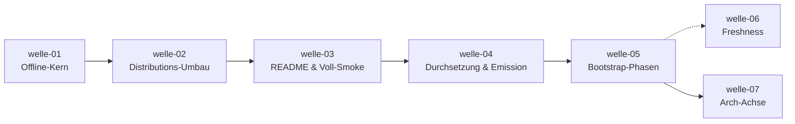

# Roadmap

**Status:** Aktiv. **Letzte Änderung:** 2026-07-25.

**Format-Regel:** Die Roadmap ist eine Reihenfolge von **Wellen**,
keine Reihenfolge von Terminen (siehe
[Kurs Modul 6](https://github.com/pt9912/ai-harness-course/blob/v3.5.1/kurs/de/02-planung/modul-06-roadmap.md)).
Termine werden — falls überhaupt — als Konsequenz der Wellen-Schätzung
gezeigt, nicht als Treiber.

---

## Aktuelle Welle

**Keine aktive Welle.** Die nächste ist **nicht** geschnitten (cp-Disziplin: Plandatei erst per `cp`,
wenn ihr erster Slice steht) — Kandidaten unten.

**Ohne Welle in Arbeit** (Wartung, Präzedenz slice-026/027/043/047/048):

| Slice | Trigger (beobachtbar) | Closure-Kriterium |
|---|---|---|
| [slice-049](../open/slice-049-baseline-bump-v3.5.2.md) — Baseline-Re-Vendor v3.5.1 → v3.5.2, `open/` | `make baseline-freshness` meldet `v3.5.1 < v3.5.2` (2026-07-25 gemessen) | DoD vollständig · `baseline-verify` + `gates` + `mutate` + `baseline-freshness` grün · CR-Regel-Entscheidung in [`harness/conventions.md`](../../../../harness/conventions.md) |

## Nächste Wellen

Keine weitere Welle ist geschnitten (cp-Disziplin — Plandatei erst per `cp`, wenn ihr erster Slice steht).
Prospektive Kandidaten (nur mit **beobachtbarem Trigger**, Modul 6). **Diese Tabelle führt nur, was
*noch nicht* geschnitten ist** — ein geschnittener Slice steht unter *Aktuelle Welle*, sonst wird
derselbe Stand an zwei Orten gepflegt und einer davon altert (real passiert mit slice-047/048):

| Welle-Kandidat | Trigger | Wichtigste Slices | Aufwand |
|---|---|---|---|
| Doc-Gate-Härtung | erneut beobachtete Befund-Klasse (Muster slice-026: neun Instanzen → Sensor) | Anker-Fragment-Sensor · Prosa-Zahlen-Provenienz · citations (slice-014/015) | S |
| **Vollstaendigkeits-Waechter fuer kuratierte Listen** (Inventar gegen Abdeckung) — schliesst zugleich die Freshness-Luecke (bats · shellcheck · actionlint) | am 2026-07-25 fand ein NUTZER den veralteten bats-Pin von Hand (real 1.11.0) — der Nachtlauf konnte ihn nicht finden, weil es fuer diese drei Images keinen Sensor gibt; [`harness/conventions.md`](../../../../harness/conventions.md) behauptete trotzdem, er decke „jede versions-gepinnte Komponente" ab (Aussage inzwischen korrigiert) | Drei Achsen ergaenzen. Mechanischer Kniff: die drei sind **nur per Digest** gepinnt, tragen also keinen Versions-String — die Version aus dem **gepinnten Image selbst** lesen (`bats --version`, `shellcheck --version`, `actionlint -version`) und gegen `releases/latest` vergleichen; so entsteht keine zweite Quelle, die driften kann. Danach den bats-Pin real bumpen. **Die Verallgemeinerung ist der eigentliche Gewinn:** das Repo fuehrt ZWEI kuratierte Listen, und beide pruefen nur ihre Eintraege, nie ihre Vollstaendigkeit — `upstream-drift` prueft jeden GELISTETEN Pin (nicht, ob jeder Pin gelistet ist), `make mutate` prueft jeden GELISTETEN Waechter (nicht, ob jeder Waechter gelistet ist). Derselbe Bauplan deckt beide: **Inventar einsammeln, gegen die Abdeckungs-Menge halten, Differenz melden** — Pins aus `Makefile`/`d-check.mk` gegen die `freshness-*`-Targets, Waechter gegen die `# expect:`-Menge. Damit faellt Achse 5 des Wartungs-Kandidaten mit hierher. Bedarfsnachweis real: den veralteten bats-Pin fand ein Mensch, kein Sensor | M |
| **Verifikations-Quadrant schließen** (Closure-Notiz bekommt einen Sensor) | am 2026-07-25 gemessen, ausgelöst durch eine Nutzer-Frage nach dem fehlenden Verifier-Skill: `grep '^verify' Makefile` ist **leer**, und `.harness/skills/` enthält nur `reviewer.md` — obwohl Modul 11 `closure-note-reviewer.md` namentlich als Schwester-Skill nennt und das Template im vendored Baum liegt. Ein **Verifier**-Skill fehlt zu Recht (den kennt das Regelwerk nicht); die Closure-Notiz-Pflicht ist aber nur *inferential feedforward* verankert — kein Sensor prüft je, ob eine Notiz existiert oder ob sie Substanz statt Floskeln trägt. **Nachgemessen ist es eine Dogfood-Lücke, keine bloß unbezogene Ziel-Form:** das Tool **emittiert** `closure-note-reviewer.md` seit slice-030 in **jedes** Ziel-Repo ([`internal/emit/templates.go`](../../../../internal/emit/templates.go), Erwartung in `TestTemplates_*`) — wir liefern den Skill also aus, ohne ihn selbst zu führen | `closure-note-reviewer.md` per `cp` aus dem Template · `make verify-closure-note`: jeder Slice in `done/` hat §7 gefüllt (deterministische Schicht) · Floskel-Erkennung bleibt inferentiell (Modul 11 trennt beides ausdrücklich). **Das Argument ist unser eigenes:** slice-026 entstand aus „Hard Rule nur in einem Quadranten ist halb durchgesetzt" — dieselbe Klasse, andere Regel | S |
| **Doku- und Sensor-Wartung** (Trigger **beobachtet** 2026-07-25, wahrscheinlich **zwei** Slices — Schnitt-Vorschlag beim Anlegen) | dieselbe Aussage musste in zwei Dateien geschrieben werden; ein Lifecycle-Move machte CI auf `main` rot; eine re-verankerte Mutation liess einen Waechter unbewacht zurück | (1) **Dopplung**: 25 % von [`AGENTS.md`](../../../../AGENTS.md) sind nahezu wortgleich in [`harness/README.md`](../../../../harness/README.md), ein 814-Zeichen-Absatz identisch → eine Quelle je Aussage · (2) **Abwärts-Verweise**: neun Slice-IDs in [`AGENTS.md`](../../../../AGENTS.md), sieben in [`harness/README.md`](../../../../harness/README.md), null in `CLAUDE.md`; `matrix` um eine `briefing`-Klasse erweitern (Gate-Anheben nach [`MR-001`](../../../../harness/conventions.md#mr-001--doc-gate-schärfung-matrix--link-pflicht--anker-ids)-Muster) · (3) **Herkunfts-Prosa** in [`harness/tools/mutate.sh`](../../../../harness/tools/mutate.sh): 69 Zeilen Kopf, 12× „Review-Befund" — Regel bleibt, Fall-Nummer geht · (4) **Lifecycle-Move-Konvention**: eingehende Links gehören in den Move-Commit (Hard Rule 3.3 schützt die *verschobene* Datei, nicht die Verweisenden) · (5) **Sensor Wächter↔Fall**: jeder Wächter ohne `test/mutations/`-Fall wird gelistet — die Klasse „entfernte/re-verankerte Mutation lässt einen Wächter nackt" ist zweimal real eingetreten | M |

*(Arch-Gate/M4 war [welle-07-arch-achse](../done/welle-07-arch-achse.md) — 2026-07-25 geschlossen, Meilenstein erreicht.)*

## Meilensteine

| Meilenstein | Welle(n) | Trigger | Status |
|---|---|---|---|
| M1 — lauffähiger Offline-Kern (`cmd/ai-harness-init` parst + emittiert Gate-Baseline + legt Templates ab, ohne Netz) | welle-01 | slice-001a/001b/002/003 done | **erreicht (2026-07-18)** |
| M2 — vollständiger Bootstrap (inkl. Sprachskelett-Generator + Root-README) | welle-02 **und** welle-03 | slice-005 + slice-024 in `done/` **und** Voll-E2E-Smoke grün (welle-03-Closure) | **erreicht (2026-07-22)** |
| M3 — durchsetzender, phasierter Harness (emittierter Repo erzwingt den Prozess: Hooks + Command-Guard + Workflow-Anleitung; Bootstrap phasiert + idempotent: doc-führt auch für die Zielsprache, `add-lang`/Mono-Repo) | welle-04 **und** welle-05 | welle-04 + welle-05 in `done/` **und** `make full-smoke` grün über die Durchsetzungs- + Idempotenz-Fitness (Guard blockt, Gate-Nachweis-Kreis geschlossen, 2. Init-Lauf idempotent, kein Prune) | **erreicht (2026-07-23)** |
| M4 — Arch-Gate integriert (a-check, [`LH-FA-07`](../../../../spec/lastenheft.md#lh-fa-07--arch-gate-baseline-emittieren)) | [welle-07-arch-achse](../done/welle-07-arch-achse.md) | ein Skelett trägt hexSlice-Schichten (`domain`/`application`/`ports`/`adapters`) **und** der a-check-Emitter ist gebaut → a-check wird emittiert + aktiv (sonst [`LH-QA-01`](../../../../spec/lastenheft.md#lh-qa-01--keine-halluzinierten-gates-f4-f5-f6)-Verstoß über leerem Prüfbereich) | **erreicht** (welle-07 geschlossen 2026-07-25; `make full-smoke` belegt beide Richtungen real) |
| M5 — **erstes Release** (`v0.1.0` mit vorgefertigten Binaries für die sechs Plattformen) | ohne Welle: [slice-049](../open/slice-049-baseline-bump-v3.5.2.md) → Doku-Nachzug → Tag | drei Schritte in dieser Reihenfolge (Nutzer-Entscheidung 2026-07-25): (1) Re-Baseline v3.5.2, damit `v0.1.0` keinen veralteten Regelwerks-Stand ausliefert · (2) Doku-Nachzug — [README](../../../../README.md) und [Benutzerhandbuch](../../../user/benutzerhandbuch.md) behaupten noch „keine vorgefertigten Release-Binaries", der Installations-Abschnitt kennt nur den Bau aus Quelle · (3) Tag `v0.1.0` mit grünem `release`-Lauf und sechs Assets | **offen** — der Pfad ist bewiesen, nicht der Meilenstein: die `v0.1.0-RC`-Probe lief grün über alle acht Jobs (Bau, sechs Plattform-Start-Smokes, `publish`), das Prerelease wurde danach entfernt ([slice-048](../done/slice-048-release-artefakte.md) §Nachtrag) |

## Abhängigkeitsgraph

```mermaid
flowchart LR
    W1[welle-01<br/>Offline-Kern]
    W2[welle-02<br/>Distributions-Umbau]
    W3[welle-03<br/>README & Voll-Smoke]
    W4[welle-04<br/>Durchsetzung & Emission]
    W5[welle-05<br/>Bootstrap-Phasen]
    W6[welle-06<br/>Freshness]
    W7[welle-07<br/>Arch-Achse]
    W1 --> W2 --> W3 --> W4 --> W5
    W5 -.-> W6
    W5 --> W7
```

## Abgeschlossene Wellen

| Welle | Abschluss | Closure-Notiz |
|---|---|---|
| [welle-01-offline-kern](../done/welle-01-offline-kern.md) | 2026-07-18 | [welle-01-results.md](../done/welle-01-results.md) |
| [welle-02-fetch-und-readme](../done/welle-02-fetch-und-readme.md) | 2026-07-21 | [welle-02-results.md](../done/welle-02-results.md) |
| [welle-03-readme-und-smoke](../done/welle-03-readme-und-smoke.md) | 2026-07-22 | [welle-03-results.md](../done/welle-03-results.md) |
| [welle-04-durchsetzung-und-emission](../done/welle-04-durchsetzung-und-emission.md) | 2026-07-22 | [welle-04-results.md](../done/welle-04-results.md) |
| [welle-05-bootstrap-phasen](../done/welle-05-bootstrap-phasen.md) | 2026-07-23 | [welle-05-results.md](../done/welle-05-results.md) |
| [welle-06-freshness](../done/welle-06-freshness.md) | 2026-07-24 | [welle-06-results.md](../done/welle-06-results.md) |
| [welle-07-arch-achse](../done/welle-07-arch-achse.md) | 2026-07-25 | [welle-07-results.md](../done/welle-07-results.md) |

## Historische Trigger-Verschiebungen

| Datum | Was wurde geändert? | Warum? |
|---|---|---|
| 2026-07-23 | **M3 nachgetragen** (durchsetzender, phasierter Harness; welle-04 **und** welle-05), bei der welle-05-Closure | Die Meilenstein-Tabelle endete bei M2, während welle-04 (Durchsetzung + Anleitung emittiert) und welle-05 (phasierter, idempotenter Bootstrap, `add-lang`/Mono-Repo) danach einen Fähigkeits-Sprung lieferten — die Tabelle hinkte zwei Wellen hinterher. [welle-04-results.md](../done/welle-04-results.md) hatte den „vollständiger Harness inkl. Durchsetzung"-Meilenstein bereits vorregistriert. Bewusst **nicht** „vollständig" genannt: das Arch-Gate (a-check) fehlt noch (Kandidat für ein späteres M4 mit Release-Binaries) |
| 2026-07-20 | **slice-027 neu** (CI), Harness-Wartung ohne Welle; `make mutate` zusätzlich als Closure-Kriterium in welle-02/03 verankert | Gemessen beim Berichten der slice-026-Restrisiken: es gibt **keine CI**, und `make mutate` stand in keinem Trigger — ein Sensor ohne Auslöser. Schwerer wiegt: [`MR-003`](../../../../harness/conventions.md#mr-003--härtung-inhaltsbasierter-nachweis-und-sub-shell-prüfung) benennt seit 2026-06-13 als Restlücke des Gate-Nachweises „frischer Klon … (**CI ist dort das Netz**)" — dieses Netz existiert nicht, die Lücke ist seither unabgedeckt |
| 2026-07-20 | **slice-026 neu** (Mutations-Sensor `make mutate`), Harness-Wartung ohne Welle; Empfehlung: vor den restlichen welle-02-Slices | [`AGENTS.md`](../../../../AGENTS.md) §3.6 entstand aus neun Instanzen einer Befund-Klasse — hat aber **kein** computational feedback, anders als 3.1–3.5. Modul 9: „Hard Rule nur in einem Quadranten ist halb durchgesetzt … Beides ist Pflicht." Beleg kam sofort: der 022b-Re-Review-Befund N-1 ist eine Instanz der Klasse, entstanden **nach** 3.6 und von `make gates` nicht bemerkt |
| 2026-07-20 | **slice-025 neu** (Bootstrap-Kette absichern), eingeschoben **vor** slice-023/004b; Kette jetzt 022a→022b→025→023→004b | Die Teil-Bootstrap-Klasse stand bei ihrer **vierten** Wiederholung (slice-002 I1 → 003 I1 → 004a L3 → 022a I1). Die in slice-004a protokollierte Lösung („gemeinsamer Pre-Flight") war dreimal einem Folge-Slice zugewiesen und nie geliefert; ein viertes Weiterreichen wäre ein Muster, kein Plan. Eigener Slice statt Carveout, weil der Trigger nicht *erreichbar* fehlte, sondern die Zuweisung nicht trug |
| 2026-07-20 | **slice-022 → slice-022a/022b re-sliced** (vor der Implementierung, Modul-5-Rücksprung; Kette jetzt 022a→022b→023→004b) | Ist-Messung deckte auf: der Fetch-Umbau ist ZIP≠Tar (Kernlogik, kein „update"), und [`LH-FA-09`](../../../../spec/lastenheft.md#lh-fa-09--regelwerk-emittieren)s Prüfsummen-AC braucht einen **Ziel-Verifier**, den weder Template-Satz noch Emit-Pfad liefern — zusammen über der Ein-Sitzungs-Review-Linie. 022a additiv, 022b räumt ab; Zwischenzustand von `skel-drift.bats` bewacht |
| 2026-07-20 | **welle-02 umgeplant** (nicht geschlossen): Ziel auf den Distributions-Umbau fokussiert, slice-022/023 neu, slice-004b re-gescopet, slice-005 nach welle-03 umgehängt; **welle-03 neu**; **M2 auf welle-02+welle-03** verteilt | [`ADR-0005`](../../../../docs/plan/adr/0005-ziel-repo-distribution.md) machte das Wellen-Ziel („Skelett vom Kurs-Tag holen") und den Closure-Trigger ungültig. Kappen wäre die Auditierbarkeits-Lücke aus Modul 6 („Welle ≠ Sprint") — dieselbe Umplanungs-Antwort wie beim Go-Pivot 2026-07 |
| 2026-07-18 | welle-01 geschlossen; welle-02 aktiviert; M1 erreicht | Trigger „alle welle-01-Slices `done/` + `make gates` grün" erfüllt |
| 2026-07 | welle-01-Slices auf die Go-Ära re-geschnitten (slice-001 → 001a/001b) | Impl-Sprache Go / native Binaries ([`ADR-0003`](../../../../docs/plan/adr/0003-go-native-binaries.md)); slice-001 zu groß (Modul-5-Rücksprung) |
