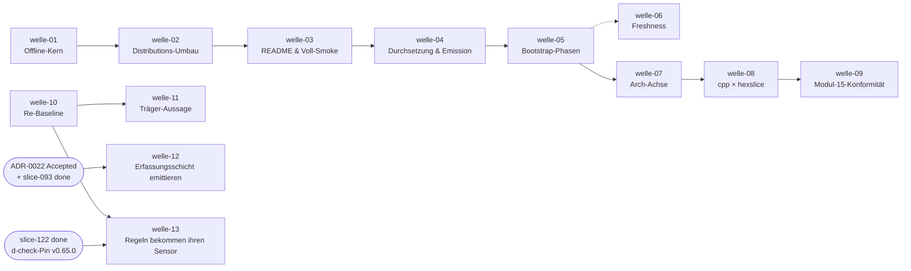

# Roadmap

**Format-Regel:** Die Roadmap ist eine Reihenfolge von **Wellen**, keine Reihenfolge von Terminen
(Baseline-Regelwerk `modul-06-roadmap.md`). Termine werden — falls überhaupt — als Konsequenz der
Wellen-Schätzung gezeigt, nicht als Treiber. Was eine einzelne Welle liefert und woran sie schließt,
steht in **ihrer** Plan-Datei; was ein einzelner Slice geliefert und gelernt hat, in **seiner**
Closure-Notiz unter [`done/`](../done).

---

## Offene Wellen

Regeln dieser Sektion: Baseline-Regelwerk `modul-06-roadmap.md`
§Roadmap-Struktur: fünf Abschnitte — der Abschnitt ist **derivativ**: Der Zustand sind die flachen
Welle-Dateien; woran gearbeitet wird, sagt das `Welle:`-Feld der Slices in
[`in-progress/`](../in-progress). Ziel, Trigger und Closure-Kriterien stehen in der Welle-Datei,
nicht hier.

- [welle-09 — Modul-15-Konformität](../welle-09-modul-15-konformitaet.md)
- [welle-10 — Re-Baseline `v3.5.2` → `v5.12.0`](../welle-10-re-baseline.md)

**Eine Position der Ziel-Form ist nicht übernommen, und hier steht der Grund**
([`MR-000`](../../../../harness/conventions.md#mr-000--baseline-aussage): eine unerklärte Abweichung
ist ein Fork, keine Adaption). Die Ziel-Form setzt *flache Welle-Datei* mit *offene Welle* gleich —
ihre Liste ist eine Bijektion in beide Richtungen. Dieses Repo schneidet die Welle-Datei, **bevor**
der Start-Trigger eintritt; `ls docs/plan/planning/welle-*.md` führt darum mehr Dateien, als hier
Zeiger stehen. Die Differenz steht vollständig unter *Nächste Wellen*, je mit ihrem Trigger. Der
Zeiger folgt dem **eingetretenen** Start-Trigger, nicht dem Schnitt: eine Welle ohne eingetretene
Beginn-Bedingung zu eröffnen, hebt die Trigger-Disziplin auf, die dieselbe Roadmap einfordert.

**Beide Aussagen dieses Blocks sind heute unbewacht, und das ist benannt statt verschwiegen**
([`LH-QA-01`](../../../../spec/lastenheft.md#lh-qa-01--keine-halluzinierten-gates-f4-f5-f6)). Die
**Marker-Hälfte** (Ruhe-Marker genau dann, wenn `in-progress/` keinen Slice trägt) und die
**Listen-Hälfte** (Bijektion Zeiger ↔ flache Welle-Dateien) tragen kein Modul: `grep -n '^modules:'
.d-check.yml` führt `planning` nicht. Träger für beide ist
[slice-125](../open/slice-125-roadmap-und-verzeichnis-stimmen-ueberein.md) — die Invariante gilt ab
hier für diesen Abschnitt, und die Listen-Hälfte braucht dort einen Sensor, der das
Kardinalitäts-Modell kennt (mehrere offene Wellen sind der Normalfall) und die Abweichung oben
kennt.

## Nächste Wellen

Regeln dieser Sektion: Baseline-Regelwerk `modul-06-roadmap.md`
§Roadmap-Struktur: fünf Abschnitte, Bullet *Nächste Wellen* — die geordnete Vorschau: je Zeile
Welle, Trigger als beobachtbare Bedingung, wichtigste Slices und geschätzter Aufwand (S/M/L, kein
Termin).

Ein verlinkter Name hat eine flache Plan-Datei (geschnitten, Start-Trigger nicht eingetreten); ein
unverlinkter ist ein Kandidat ohne Datei und ohne geschnittene Slices.

| Welle | Trigger (beobachtbar) | Wichtigste Slices | Aufwand |
|---|---|---|---|
| [welle-11 — Träger-Aussage](../welle-11-traeger-aussage.md) | welle-10 liegt in `done/` — tragend, weil jede Messung dieser Welle über den vendored Baum läuft, den welle-10 tauscht (§2 der Plan-Datei) | `slice-090`–`slice-092` | M |
| [welle-13 — Regeln bekommen ihren Sensor](../welle-13-regeln-bekommen-ihren-sensor.md) | [`slice-122`](../done/slice-122-d-check-pin-v0650.md) liegt in `done/` (tragend) **und** welle-10 liegt in `done/` (ordnend) | `slice-123`–`slice-127`, `slice-129` | L |
| Doc-Gate-Härtung | erneut beobachtete Befund-Klasse (Muster `slice-026`: neun Instanzen → Sensor) | `test` in `codepaths.roots` aufnehmen — Gate-*Anheben* nach dem [`MR-001`](../../../../harness/conventions.md#mr-001--doc-gate-schärfung-matrix--link-pflicht--anker-ids)-Muster mit Trockenlauf vor dem Pin ([`MR-009`](../../../../harness/conventions.md#mr-009--d-check-pin-sprung-und-codepath-ventile)/[`MR-011`](../../../../harness/conventions.md#mr-011--zitat-verifikation-via-d-check-adoptiert-check-lines)); die Messung dazu führt [`MR-021`](../../../../harness/conventions.md#mr-021--das-span-schema-zieht-ins-technik-stratum-sein-eintrag-wird-aufgehoben) · Anker-Fragment-Sensor · Prosa-Zahlen-Provenienz · `citations` · die zwei Module `hostpaths` und `diagrams`, ausgeschrieben in [welle-13](../welle-13-regeln-bekommen-ihren-sensor.md) §6. **Nicht dasselbe wie** [slice-069](../open/slice-069-zahn-bindet-zusicherung.md) oder [slice-070](../open/slice-070-comment-claims-pruefbereich.md) — hier zählt die bloße **Existenz** des genannten Pfades | S |
| Vollständigkeits-Wächter für kuratierte Listen | am 2026-07-25 fand ein **Nutzer** den veralteten bats-Pin von Hand; für bats, shellcheck und actionlint gibt es keinen Freshness-Sensor | Beide kuratierten Listen prüfen ihre **Einträge**, nie ihre **Vollständigkeit** — `upstream-drift` jeden gelisteten Pin, `make mutate` jeden gelisteten Wächter. Ein Bauplan deckt beide: Inventar einsammeln, gegen die Abdeckungs-Menge halten, Differenz melden. Die drei Images sind nur per Digest gepinnt und tragen keinen Versions-String — die Version aus dem gepinnten Image selbst lesen (`bats --version`), sonst entsteht eine zweite Quelle, die driftet. Schließt Achse (5) der Doku- und Sensor-Wartung mit ein | M |
| Regeln ohne Feedback-Quadrant schließen — Rest-Achsen | die Klasse ist am 2026-07-26 sechsfach gemessen (Drift-Log unten) | Achse (1) ist in [welle-09](../welle-09-modul-15-konformitaet.md) eingefaltet, die Achsen (1)–(4) und die Sensor-Hälfte von (6) sind als [welle-13](../welle-13-regeln-bekommen-ihren-sensor.md) geschnitten. Hier bleiben: **(5)** Co-Change um [`MR-015`](../../../../harness/conventions.md#mr-015--change-request-bei-personalunion-von-auftraggeber-und-entwickler) Setzung 2 — Eigenbau mit Cutoff ab dem einführenden Commit (rückwirkend wäre er dauerhaft rot) und fail-closed bei Shallow Clone · **(6, Skill-Hälfte)** `.harness/skills/closure-note-reviewer.md` fehlt (`ls .harness/skills/ \| wc -l` → **1**), obwohl das Werkzeug sie in jedes Ziel emittiert · **(7)** veröffentlichte Artefakte außerhalb von `git`: der Release-Text von `v0.1.0` wurde viermal korrigiert, kein Gate erreicht ihn ([slice-050](../done/slice-050-doku-nachzug-release.md) §7) · **(8)** der Liefer-Punkte-Zähler; die Ist-Messung über neun Slices führt [slice-053](../done/slice-053-cpp-hexslice-renderer.md) · **(9)** die Quellen-Klausel [`AGENTS.md`](../../../../AGENTS.md) §3.7 — sie nennt sich selbst wächterlos, Träger-Kandidat ist `make comment-claims` statt d-check; gefordert ist ein **Cutoff-Mechanismus** über den geänderten Zeilen, keine Räumung des Bestands | L |
| Doku- und Sensor-Wartung | vier Beobachtungen: dieselbe Aussage musste in zwei Dateien geschrieben werden · ein Lifecycle-Move machte CI auf `main` rot · eine re-verankerte Mutation ließ einen Wächter unbewacht · vier lebende Artefakte beschreiben denselben Gate mit einer Modul-Liste, die keines von ihnen mehr trifft | (1) **Dopplung** [`AGENTS.md`](../../../../AGENTS.md) ↔ [`harness/README.md`](../../../../harness/README.md): 25 %, ein 814-Zeichen-Absatz identisch → eine Quelle je Aussage · (2) **Abwärts-Verweise**: beide nennen Slice-IDs, `CLAUDE.md` keine — `matrix` um eine `briefing`-Klasse erweitern · (3) **Herkunfts-Prosa** in [`harness/tools/mutate.sh`](../../../../harness/tools/mutate.sh); die Regel dazu trägt [`AGENTS.md`](../../../../AGENTS.md) §3.7, den Bestand niemand · (4) **Lifecycle-Move-Konvention**: [`close-welle.md`](../../../../.claude/commands/close-welle.md) löst sie als eigenen Commit **nach** dem Move auf, [`implement-slice.md`](../../../../.claude/commands/implement-slice.md) verlangt nur den reinen Move — der Widerspruch ist vor jeder Ausdehnung zu klären; die Verweis-Hälfte deckt `make slice-mv` seit `slice-144` ([`BEO-003`](../observations.md)) · (5) **Sensor Wächter↔Fall** — fällt mit dem Vollständigkeits-Wächter oben · (6) **Prosa-Aufzählung gegen ihre Config**: `git grep -ln 'links/anchors/ids/codepaths' -- ':!docs/reviews'` führt lebende Fundorte, die je **vier** Module nennen, während `grep -n '^modules:' .d-check.yml` **sechs** führt (es fehlen `matrix` und `spans`); zweiter Fall in [`README.md`](../../../../README.md): *„`make gates` bündelt sieben"* gegen `grep -c '^gates:' Makefile`. Drei ungleiche Reparaturen — Text, tool-generiertes Fragment ([`MR-010`](../../../../harness/conventions.md#mr-010--d-check-gate-fragment-tool-generiert)) und ein offener Plan | M |

## Meilensteine

Regeln dieser Sektion: Baseline-Regelwerk `modul-06-roadmap.md`
§Welle ≠ Meilenstein ≠ Release — der Meilenstein liegt *neben* der Welle und endet durch externe
Bestätigung; ein erreichter bleibt in der Tabelle, und die `Status`-Zelle trägt Zustand und Beleg,
nicht die Chronik.

| Meilenstein | Welle(n) | Trigger | Status |
|---|---|---|---|
| M1 — lauffähiger Offline-Kern (`cmd/ai-harness-init` parst + emittiert Gate-Baseline + legt Templates ab, ohne Netz) | welle-01 | `slice-001a`/`001b`/`002`/`003` in `done/` | **erreicht (2026-07-18)** — [welle-01-results.md](../done/welle-01-results.md) |
| M2 — vollständiger Bootstrap (inkl. Sprachskelett-Generator + Root-README) | welle-02 **und** welle-03 | `slice-005` + `slice-024` in `done/` **und** Voll-E2E-Smoke grün | **erreicht (2026-07-22)** — [welle-03-results.md](../done/welle-03-results.md) |
| M3 — durchsetzender, phasierter Harness (Hooks + Command-Guard + Workflow-Anleitung emittiert; Bootstrap phasiert + idempotent, `add-lang`/Mono-Repo) | welle-04 **und** welle-05 | beide Wellen in `done/` **und** `make full-smoke` grün über Durchsetzungs- und Idempotenz-Fitness | **erreicht (2026-07-23)** — [welle-05-results.md](../done/welle-05-results.md) |
| M4 — Arch-Gate integriert (a-check, [`LH-FA-07`](../../../../spec/lastenheft.md#lh-fa-07--arch-gate-baseline-emittieren)) | [welle-07-arch-achse](../done/welle-07-arch-achse.md) | ein Skelett trägt hexSlice-Schichten **und** der a-check-Emitter ist gebaut → a-check wird emittiert und ist aktiv | **erreicht (2026-07-25)** — [welle-07-results.md](../done/welle-07-results.md) |
| M5 — **erstes Release** (`v0.1.0` mit vorgefertigten Binaries für sechs Plattformen) | — | drei Schritte in dieser Reihenfolge: Re-Baseline · Doku-Nachzug · Tag mit grünem `release`-Lauf; Träger sind [slice-049](../done/slice-049-baseline-bump-v3.5.2.md) und [slice-050](../done/slice-050-doku-nachzug-release.md) | **erreicht (2026-07-26)** — Tag `v0.1.0`, `release`-Lauf 8/8 grün, sechs Assets ([slice-050](../done/slice-050-doku-nachzug-release.md) §7). Der im Tag offengelegte Doku-Mangel ist seit `v0.1.1` behoben ([slice-052](../done/slice-052-release-v0-1-1.md)) |
| M6 — **die emittierte Ebene belegt ihre eigenen Läufe** ([`LH-FA-10`](../../../../spec/lastenheft.md#lh-fa-10--erfassungsschicht-emittieren)) | [welle-12](../done/welle-12-erfassungsschicht-emittieren.md) | ein frisch gebootstrapptes Ziel schreibt bei einem Werkzeug-Aufruf einen Span mit besetzter Rollen-Achse, führt eine lesbare Feldliste und einen Leser samt Aufräum-Kommando — **oder** legt begründet nichts davon ab und bleibt grün; beide Zweige im `make full-smoke` | **erreicht (2026-08-27)** — [welle-12-results.md](../done/welle-12-results.md) §7, das auch die zwei benannten Grenzen des Belegs führt |

## Abhängigkeitsgraph

Regeln dieser Sektion: Baseline-Regelwerk `modul-06-roadmap.md`
§Roadmap-Struktur: fünf Abschnitte, Bullet *Nächste Wellen* — die Abhängigkeit steht als
beobachtbare Bedingung in der `Trigger`-Spalte **und** als gerichtete Kante hier; eine Welle, die
ohne fertige Vorgängerin nicht starten kann, ist eine Phantom-Welle. Ob eine Kante trägt oder
ordnet, sagt §2 der Welle-Datei, die sie bindet.

```mermaid
flowchart LR
    W1[welle-01<br/>Offline-Kern]
    W2[welle-02<br/>Distributions-Umbau]
    W3[welle-03<br/>README & Voll-Smoke]
    W4[welle-04<br/>Durchsetzung & Emission]
    W5[welle-05<br/>Bootstrap-Phasen]
    W6[welle-06<br/>Freshness]
    W7[welle-07<br/>Arch-Achse]
    W8[welle-08<br/>cpp × hexslice]
    W9[welle-09<br/>Modul-15-Konformität]
    W10[welle-10<br/>Re-Baseline]
    W11[welle-11<br/>Träger-Aussage]
    W12[welle-12<br/>Erfassungsschicht emittieren]
    W13[welle-13<br/>Regeln bekommen ihren Sensor]
    W1 --> W2 --> W3 --> W4 --> W5
    W5 -.-> W6
    W5 --> W7 --> W8
    W8 --> W9
    W10 --> W11
    W10 --> W13
    S122([slice-122 done<br/>d-check-Pin v0.65.0]) --> W13
    A0022([ADR-0022 Accepted<br/>+ slice-093 done]) --> W12
```

## Abgeschlossene Wellen

Regeln dieser Sektion: Baseline-Regelwerk `modul-06-roadmap.md`
§Roadmap-Struktur: fünf Abschnitte — das Closure-Log führt Abschlüsse mit Zeiger auf die
Ergebnis-Notiz, keine Nummernfolge.

| Welle | Abschluss | Closure-Notiz |
|---|---|---|
| [welle-01-offline-kern](../done/welle-01-offline-kern.md) | 2026-07-18 | [welle-01-results.md](../done/welle-01-results.md) |
| [welle-02-fetch-und-readme](../done/welle-02-fetch-und-readme.md) | 2026-07-21 | [welle-02-results.md](../done/welle-02-results.md) |
| [welle-03-readme-und-smoke](../done/welle-03-readme-und-smoke.md) | 2026-07-22 | [welle-03-results.md](../done/welle-03-results.md) |
| [welle-04-durchsetzung-und-emission](../done/welle-04-durchsetzung-und-emission.md) | 2026-07-22 | [welle-04-results.md](../done/welle-04-results.md) |
| [welle-05-bootstrap-phasen](../done/welle-05-bootstrap-phasen.md) | 2026-07-23 | [welle-05-results.md](../done/welle-05-results.md) |
| [welle-06-freshness](../done/welle-06-freshness.md) | 2026-07-24 | [welle-06-results.md](../done/welle-06-results.md) |
| [welle-07-arch-achse](../done/welle-07-arch-achse.md) | 2026-07-25 | [welle-07-results.md](../done/welle-07-results.md) |
| [welle-08-cpp-hexslice](../done/welle-08-cpp-hexslice.md) | 2026-07-27 | [welle-08-results.md](../done/welle-08-results.md) |
| [welle-12-erfassungsschicht-emittieren](../done/welle-12-erfassungsschicht-emittieren.md) | 2026-08-27 | [welle-12-results.md](../done/welle-12-results.md) |

Die Lücke zwischen `welle-08` und `welle-12` ist keine Auslassung: `welle-09` bis `welle-11` sind
geschnitten und nicht geschlossen — ihr Zustand steht oben.

## Historische Trigger-Verschiebungen

Regeln dieser Sektion: Baseline-Regelwerk `modul-06-roadmap.md`
§Roadmap-Struktur: fünf Abschnitte, Bullet *Historische Trigger-Verschiebungen* — **nur**
Umplanungen (Trigger verschoben, präzisiert, ersetzt; Slice oder Welle umgehängt). Keine
Schließungen (die stehen im Closure-Log) und keine erreichten Meilensteine (`Status`-Spalte) —
sonst führt diese Tabelle ein zweites Closure-Log, und zwei Logs driften. Das ausgeführte Argument
einer Umplanung steht im Beleg, nicht in der Zelle.

| Datum | Was wurde geändert? | Warum? | Beleg |
|---|---|---|---|
| 2026-09-02 | [`slice-150`](../done/slice-150-drei-eintraege-tragen-den-adoptierten-stand.md) in [welle-10](../welle-10-re-baseline.md) geschnitten, ohne Reihenfolge-Bindung außer der tragenden Kante zu `slice-083` | Kein Nachzügler, sondern eine Korrektur an Durchgang 1: zwei Einträge der eingefrorenen Bezugsmenge tragen die Ausgänge *bleibt gültig* bzw. *nicht eingetreten*, während der adoptierte Stand beide Setzungen wörtlich führt. Eine Welle, die darauf schließt, erfüllt ihr Kriterium der Form nach und der Sache nach nicht | [welle-10](../welle-10-re-baseline.md) §3, [`slice-082`](../done/slice-082-adaptions-durchgang.md) §9, [`BEO-013`](../observations.md) |
| 2026-08-31 | [`slice-083`](../done/slice-083-form-vergleich-pflichtfelder.md) ein zweites Mal `in-progress` → `next` zurückgeführt; die zwei offenen Spec-Posten als [`slice-147`](../done/slice-147-spezifikation-traegt-ihr-id-schema.md) und [`slice-148`](../done/slice-148-architecture-traegt-ihr-id-schema.md) neu geschnitten | `slice-083` behält nur `harness/conventions.md` — den einzigen Posten mit eigenem, noch offenem DoD-Punkt. Die zwei Spec-Dateien hängen an unabhängigen Artefaktmengen, und für sie benennt keine Quelle eine schreibende Rolle | [`ADR-0015`](../../adr/0015-rollen-eigentum-an-norm-artefakten.md), [`slice-147`](../done/slice-147-spezifikation-traegt-ihr-id-schema.md) §1 |
| 2026-08-29 | [`slice-136`](../done/slice-136-roadmap-traegt-die-ziel-form.md) in [welle-10](../welle-10-re-baseline.md) geschnitten, ohne Reihenfolge-Bindung zu den übrigen Mitgliedern | Durchgang 2 (*Form*) verlangt die neue Gliederung in den Singleton-Artefakten; diese Datei ist eines und stand in keiner Slice-Menge | [welle-10](../welle-10-re-baseline.md) §3 |
| 2026-08-29 | Der Abnahme-Punkt von [`slice-081`](../done/slice-081-baum-tauschen-pin-ziehen.md) zählt **vier** Sensoren statt drei (`make mutate` aufgenommen); DoD (2) desselben Slice ist auf den Bestand gezogen — drei Ausgänge je Inline-Nennung statt der pauschalen Zusage | `make mutate` fährt je Sensor-Modus einen Grün-Vorlauf und bricht fail-closed ab, solange ein Modus rot ist; der Lauf misst dann über **null** Fällen. Der Folgefehler braucht denselben benannten Ausgang wie das Smoke-Rot, sonst fällt der Abnahme-Punkt an seinem eigenen Auffang-Satz. Kein dritter Carveout — dieselbe Häufung im selben Geltungsbereich | [welle-10](../welle-10-re-baseline.md) §4, [`slice-130`](../done/slice-130-emitter-entscheidet-jedes-neue-template.md), [`slice-133`](../done/slice-133-emittierter-baum-ohne-platzhalter-links.md) |
| 2026-08-28 | [`slice-133`](../done/slice-133-emittierter-baum-ohne-platzhalter-links.md) in [welle-10](../welle-10-re-baseline.md) geschnitten und **vor** `slice-130` eingeordnet | Der Baum-Tausch bricht [`LH-FA-01`](../../../../spec/lastenheft.md#lh-fa-01--repo-bootstrappen) und [`LH-FA-02`](../../../../spec/lastenheft.md#lh-fa-02--zweiklassige-template-ablage-f3) im emittierten Repo. **Kein Carveout:** ein Carveout steht in keinem Rang der Source Precedence und darf nichts festlegen; Modul 7 nennt für eine Diskrepanz-Häufung die Übernahme im nächsten Slice. Sichtbar wurde der Bruch allein über `make smoke`, der nicht in `make gates` läuft | [`slice-133`](../done/slice-133-emittierter-baum-ohne-platzhalter-links.md) §1, [`MR-015`](../../../../harness/conventions.md#mr-015--change-request-bei-personalunion-von-auftraggeber-und-entwickler) |
| 2026-08-28 | [welle-13](../welle-13-regeln-bekommen-ihren-sensor.md) geschnitten und in *Nächste Wellen* aufgenommen; die Achsen (1)–(4) des Kandidaten *Regeln ohne Feedback-Quadrant schließen* dorthin gezogen, (5)–(8) bleiben Kandidat. Aufwands-Schätzung von „zwei bis drei Slices" auf fünf ersetzt | Auslöser gemessen: `make freshness-dcheck` meldet `gepinnt: v0.62.0 / latest: v0.65.0`, Exit 1. **Pin und Adoption sind getrennt:** der Pin-Lauf antwortet unter beiden Versionen byte-gleich, während jedes Kandidaten-Modul ohne eigenen Config-Block inert ist und seinen eigenen Trockenlauf braucht. „Bereits bezahlt" gilt dem Bau, nicht der Adoption | [welle-13](../welle-13-regeln-bekommen-ihren-sensor.md) §1, [`MR-024`](../../../../harness/conventions.md#mr-024--d-check-pin-v0620-structure-verfügbar) |
| 2026-08-28 | Die Trigger-Kante [welle-09](../welle-09-modul-15-konformitaet.md) → [welle-10](../welle-10-re-baseline.md) aufgelöst; welle-10 wird startbar, welle-09 bleibt offen und ruhend. Die Kante fällt aus dem Abhängigkeitsgraphen, `W10 → W11` bleibt | Die Kante stand aus Ordnungs-, nicht aus Risiko-Gründen: sie schützte die Messlatte von welle-09 vor dem Baseline-Tausch. Drei Messungen heben den Schutz auf — der Ziel-Text ist schon vor dem Tausch gemessene Grundlage einer angenommenen Entscheidung dieses Repos | [welle-10](../welle-10-re-baseline.md) §2, [welle-09](../welle-09-modul-15-konformitaet.md) §1, [`ADR-0022`](../../adr/0022-erfassungsschicht-traeger-aus-dem-produkt-binaer.md) |
| 2026-08-28 | [welle-13](../welle-13-regeln-bekommen-ihren-sensor.md) trägt einen sechsten Slice: `slice-129` (Closure-Notiz-Sensor). Vom Kandidaten bleibt die Skill-Datei, nicht der Sensor | Der Anlass ist eine Quelle, gegen die niemand gelesen hatte — das Benutzerhandbuch des gepinnten Werkzeugs statt seiner `--print-config`-Ausgabe. Es führt für `planning` drei Fähigkeiten; der Schnitt kannte zwei. Die dritte ist genau die deterministische Hälfte, die Achse (6) als Eigenbau veranschlagte | [welle-13](../welle-13-regeln-bekommen-ihren-sensor.md) §6 |
| 2026-08-27 | Zielstand von [welle-10](../welle-10-re-baseline.md) auf `v5.12.0` gezogen (in zwei Schritten nachgeholt); die offenen Slices `slice-080`–`slice-083` und `slice-085` mitgezogen, `slice-084` unberührt | Zwei Auftraggeber-Setzungen, keine gemessenen Defekte. Die Plan-Regel über die Bewegung des Zielstands bindet die Rollen dieses Repos, nicht den Auftraggeber; sie ist im Plan durch einen Zeiger auf die Entscheidung ersetzt statt wiederholt | [`ADR-0018`](../../adr/0018-ziel-fassung-regiert-die-migration.md) §*Wer den Zielstand bewegt* |
| 2026-08-25 | `slice-071` neu geschnitten und aus [welle-09](../welle-09-modul-15-konformitaet.md) genommen; er trägt ab jetzt die zwei Angaben, die `make span-report` über seinen eigenen Bestand schuldig bleibt | Die Festlegung hatte einen Adressaten, und der ist entfallen: die Verbrauchs-Achse je Rolle steht permanent ohne Quelle, damit wird die Rechnung nie geschnitten, für die Namen, Counter-Form und Ort der Division gelten sollten. Was die Matrix-Zelle braucht, liefert die ADR selbst | [`ADR-0021`](../../adr/0021-verbrauchs-achse-je-rolle-ohne-quelle.md) Festlegung 1/3, [slice-066](../done/slice-066-telemetrie-auswertung.md) §7 |
| 2026-08-16 | Drei Zellen der Tool-Spalte von [welle-09](../welle-09-modul-15-konformitaet.md) tragen *ADR-Verdikt* statt *nicht emittiert mit Auflösungs-Trigger*; [`slice-087`](../done/slice-087-emittierte-doku-tische-init-invariant.md) wird **Mitglied** der Welle statt wellenlos | Die Schwelle *„die Erfassung läuft ohne Kompilat"* ist nicht ernst erreichbar — ein Trigger wäre eine Frist, die niemand einlösen kann. Und das Closure-Kriterium hing an einem Nicht-Mitglied ohne Eintritts-Trigger; das ist keine Bedingung, sondern ihre Verschiebung | [welle-09](../welle-09-modul-15-konformitaet.md) §3/§4 |
| 2026-08-16 | `slice-062` trägt einen statt zwei Liefergegenstände: die ADR, keinen Change Request | Block 4 bekommt kein neues Artefakt — Träger ist das advisory `make doc-targets`, das mit `d-check.mk` ohnehin ins Ziel geht. Damit wächst die Aufzählung emittierter Mechanik nicht, und der Change-Request-Fußabdruck hat keinen Gegenstand; die Modul-Bedingung wird von einer Konfiguration **erfüllt**, nicht geändert | [`LH-FA-03`](../../../../spec/lastenheft.md#lh-fa-03--doc-gate-baseline-emittieren-f6-f7), [`MR-001`](../../../../harness/conventions.md#mr-001--doc-gate-schärfung-matrix--link-pflicht--anker-ids) |
| 2026-08-09 | Zielstand von [welle-10](../welle-10-re-baseline.md) auf `v5.3.1` gezogen, und die Version fällt aus dem Dateinamen der Plan-Datei | Der Zielstand wandert nur, wenn in ihm ein gemessener Defekt liegt, der eine Entscheidung dieses Repos berührt — nicht, weil ein neuerer Tag existiert. Beides traf zu, und der Wechsel kostet nichts Gemessenes | [welle-10](../welle-10-re-baseline.md) §1, [`ADR-0015`](../../adr/0015-rollen-eigentum-an-norm-artefakten.md) |
| 2026-08-09 | [welle-10](../welle-10-re-baseline.md) geschnitten (`slice-080`–`slice-085`) und als *geplante* Welle geführt; der Kandidat *Re-Baseline auf den aktuellen Kurs-Stand* fällt aus der Tabelle | Der Trigger ist gemessen: `make baseline-freshness` meldet VERALTET, zwischen gepinnt und upstream liegen zehn Releases mit drei Major-Sprüngen. Der Kandidat unterschätzte den Sprung als Pin-Wechsel; gemessen ist er strukturell, und vier `Accepted`-ADRs zeigen in den Baum | [welle-10](../welle-10-re-baseline.md) §1/§2 |
| 2026-07-31 | `slice-066` re-geschnitten in `slice-066` (Token-Bilanz) und `slice-071` (Cache-Rechnung); [welle-09](../welle-09-modul-15-konformitaet.md) kennt als weitere Belegart das **ADR-Verdikt** — permanente Abweichung ohne Auflösungs-Trigger | Jede Token-Bilanz aus diesem Bestand muss ihren Nenner nennen; die Angabe braucht einen eigenen DoD-Punkt samt zwei Zähnen, und `slice-066` trug bereits drei Punkte. Auf dem ADR-Pfad fällt der Auflösungs-Trigger weg, während der Welle-Plan „deklariert" über einen Trigger definierte | [`ADR-0012`](../../adr/0012-haupt-kontext-ohne-token-bilanz.md), [welle-09](../welle-09-modul-15-konformitaet.md) §3 |
| 2026-07-28 | [welle-09](../welle-09-modul-15-konformitaet.md) geschnitten und eröffnet; Achse (1) des Kandidaten *Regeln ohne Feedback-Quadrant schließen* dorthin eingefaltet | Nutzer-Befund: Modul 15 liegt seit `554cade` vendored im Repo, taucht in vier Commits auf (allesamt Re-Vendor) und wurde nie inhaltlich behandelt. Ursache mechanisch: die Adoptions-Prüfung sieht bei jeder Re-Baseline nur das Delta, nie den Bestand | [welle-09](../welle-09-modul-15-konformitaet.md) §1 |
| 2026-07-27 | [welle-08](../done/welle-08-cpp-hexslice.md) geschnitten und eröffnet; der Abhängigkeitsgraph bekommt die Kante `W7 → W8` | Ist-Abgleich nach dem `slice-052`-Abschluss: die Arch-Achse trägt **eine** Sprache, obwohl [`LH-FA-04`](../../../../spec/lastenheft.md#lh-fa-04--sprachskelett-picker-f4) sie als `lang × arch`-Komposition beschreibt. Die Vorbedingung wurde vor dem Schnitt gemessen statt angenommen | [welle-08](../done/welle-08-cpp-hexslice.md) §1 |
| 2026-07-26 | Der Block *„ohne Welle geschnitten"* und die Closure-Absätze zu `slice-049`/`slice-050` verlassen den ersten Abschnitt; er trägt wieder nur die Aussage über die Welle | Nutzer-Beobachtung: ein Abschnitt, der *„Keine aktive Welle"* meldet, war 23 Zeilen lang. Der Lifecycle-Zustand **ist** das Verzeichnis; ihn hier abzuschreiben erzeugt eine zweite Quelle, die altert — derselbe Fehler wie am 2026-07-25 | Baseline-Regelwerk `modul-06-roadmap.md` §Wann Arbeit eine Welle braucht, [`README.md`](../README.md) |
| 2026-07-26 | Kandidat *Verifikations-Quadrant schließen* (S) **subsumiert** in *Regeln ohne Feedback-Quadrant schließen* (L) | Beim `slice-049`-Abschluss wurde die Klasse **sechsmal** gemessen statt einmal. Zwei Zeilen derselben Klasse zu führen ist genau die Doppelführung, an der `slice-047`/`048` hier gealtert sind; Achse (6) bleibt ausdrücklich unabhängig vorziehbar | [welle-13](../welle-13-regeln-bekommen-ihren-sensor.md) §1 |
| 2026-07-25 | Der erste Abschnitt auf seine Pflicht-Bestandteile zurückgeschnitten; die Kandidaten-Tabelle führt ab jetzt nur noch **Ungeschnittenes** | Der Release-Weg stand als Fließtext beim laufenden Wellen-Zustand — falscher Ort: Modul 6 nennt das Release den Musterfall eines Meilensteins. Zugleich stand derselbe Stand doppelt und war real gealtert: [slice-047](../done/slice-047-mutate-host-isolation.md) lief noch als `in-progress`, [slice-048](../done/slice-048-release-artefakte.md) fehlte ganz, obwohl beide geschlossen waren | Baseline-Regelwerk `modul-06-roadmap.md` §Welle ≠ Meilenstein ≠ Release |
| 2026-07-20 | `slice-027` neu (CI), Harness-Wartung ohne Welle; `make mutate` zusätzlich als Closure-Kriterium in welle-02/03 verankert | Gemessen beim Berichten der `slice-026`-Restrisiken: es gibt **keine** CI, und `make mutate` stand in keinem Trigger — ein Sensor ohne Auslöser. Schwerer wiegt die seither unabgedeckte Restlücke des Gate-Nachweises: *„frischer Klon … CI ist dort das Netz"* | [`MR-003`](../../../../harness/conventions.md#mr-003--härtung-inhaltsbasierter-nachweis-und-sub-shell-prüfung) |
| 2026-07-20 | `slice-026` neu (Mutations-Sensor `make mutate`), Harness-Wartung ohne Welle; Empfehlung: vor den restlichen welle-02-Slices | [`AGENTS.md`](../../../../AGENTS.md) §3.6 entstand aus neun Instanzen einer Befund-Klasse, hatte aber kein computational feedback — anders als 3.1–3.5. Der Beleg kam sofort: ein Re-Review-Befund ist eine Instanz der Klasse, entstanden **nach** 3.6 und von `make gates` nicht bemerkt | [`AGENTS.md`](../../../../AGENTS.md) §3.6 |
| 2026-07-20 | `slice-025` neu (Bootstrap-Kette absichern), eingeschoben **vor** `slice-023`/`004b`; Kette jetzt 022a→022b→025→023→004b | Die Teil-Bootstrap-Klasse stand bei ihrer **vierten** Wiederholung. Die protokollierte Lösung war dreimal einem Folge-Slice zugewiesen und nie geliefert; ein viertes Weiterreichen wäre ein Muster, kein Plan. Eigener Slice statt Carveout, weil nicht der Trigger fehlte, sondern die Zuweisung nicht trug | [slice-025](../done/slice-025-bootstrap-preflight.md) §1 |
| 2026-07-20 | `slice-022` → `slice-022a`/`022b` re-sliced vor der Implementierung; Kette jetzt 022a→022b→023→004b | Ist-Messung: der Fetch-Umbau ist ZIP≠Tar (Kernlogik, kein Update), und das Prüfsummen-Akzeptanzkriterium braucht einen Ziel-Verifier, den weder Template-Satz noch Emit-Pfad liefern — zusammen über der Ein-Sitzungs-Review-Linie | [`LH-FA-09`](../../../../spec/lastenheft.md#lh-fa-09--regelwerk-emittieren), [slice-022a](../done/slice-022a-baseline-fetch.md) §1 |
| 2026-07-20 | welle-02 **umgeplant** (nicht geschlossen): Ziel auf den Distributions-Umbau fokussiert, `slice-022`/`023` neu, `slice-004b` re-gescopet, `slice-005` nach welle-03 umgehängt; **welle-03 neu**; M2 auf welle-02+welle-03 verteilt | Die Entscheidung zur Ziel-Repo-Distribution machte das Wellen-Ziel und den Closure-Trigger ungültig. Kappen wäre die Auditierbarkeits-Lücke aus *Welle ≠ Sprint* | [`ADR-0005`](../../adr/0005-ziel-repo-distribution.md) |
| 2026-07 | welle-01-Slices auf die Go-Ära re-geschnitten (`slice-001` → `001a`/`001b`) | Implementierungssprache Go / native Binaries; `slice-001` war zu groß und ging zurück zum Schneiden | [`ADR-0003`](../../adr/0003-go-native-binaries.md) |
