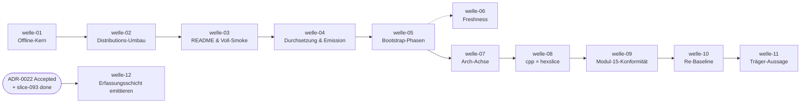

# Roadmap

**Status:** Aktiv. **Letzte Änderung:** 2026-08-27.

**Format-Regel:** Die Roadmap ist eine Reihenfolge von **Wellen**,
keine Reihenfolge von Terminen (siehe
[Kurs Modul 6](https://github.com/pt9912/ai-harness-course/blob/v3.5.2/kurs/de/02-planung/modul-06-roadmap.md)).
Termine werden — falls überhaupt — als Konsequenz der Wellen-Schätzung
gezeigt, nicht als Treiber.

---

## Aktuelle Welle

**[welle-09 — Modul-15-Konformität](../welle-09-modul-15-konformitaet.md)**, geschnitten am 2026-07-28
— **angefangen, nicht abschließbar**: ihre Closure hängt an drei Mitgliedern, die §4 der Welle
benennt und die nie geschnitten wurden
(`ls docs/plan/planning/*/ | grep -cE '^slice-(061|063|064)-'` → **0**). Ohne sie bleiben zwei
Zellen der Konformitäts-Matrix leer, und §3 der Welle nennt eine leere Zelle einen offenen Trigger.
Ihre geschnittenen Mitglieder liegen sämtlich in `done/`; was fehlt, ist eigene Arbeit, keine
fremde Vorbedingung.

**Slices:** in `done/` liegen `slice-059` (Erfassung) · `slice-060` (Rollen-Achse) ·
`slice-066` (Token-Bilanz) · `slice-068` (Rollen-Arbeit läuft als Rolle) ·
`slice-062` (Tool-Ebene, Entscheidung: **nur** ADR — kein CR, weil kein neues Artefakt
ins Ziel geht und damit keine Anforderung wächst; der Wert der vierten Matrix-Zelle ist
festgelegt, sein Ziel-Beleg bleibt Schuld der Welle) ·
[`slice-087`](../done/slice-087-emittierte-doku-tische-init-invariant.md) (Tool-Ebene, Vorarbeit:
kein emittiertes Dokument behauptet noch ein nicht Init-invariantes `make`-Ziel, in beiden
Bootstrap-Varianten und von einem netzlosen Wächter gehalten — Eintritts-Bedingung des Belegs).
**Kein geschnittener Slice der Welle ist mehr offen:** die Zelle *Cache-Counter × Repo* trägt ihren
Wert aus [`ADR-0021`](../../adr/0021-verbrauchs-achse-je-rolle-ohne-quelle.md) (Folgepflicht 3),
nicht aus einer Festlegung im Spec-Stratum — der Slice, der sie schreiben sollte, ist ohne Adressat
und neu geschnitten (Closure-Log unten, 2026-08-25).
`slice-061`, `slice-063` und `slice-064` sind in §4 der Welle benannt, aber **nicht** geschnitten (cp-Disziplin) — **an ihnen und nur an ihnen hängt die Closure**. Ihr Lifecycle-Zustand ist ihr Verzeichnis, nicht diese Zeile.
**Mit `slice-063` geht eine Messung, die sonst keinen Besitzer hat:** ob das Modul `targets` eine
`make`-Nennung in Prosa außerhalb einer Tabelle überhaupt sieht
([`ADR-0020`](../../adr/0020-emittierte-modul-15-regeln.md) Festlegung 4(d)). Sie entscheidet
allein, ob `doc-tables:` den emittierten Closure-Note-Reviewer-Skill je decken **könnte**, und
gehört an den Lauf, der den `targets:`-Block im Ziel konfiguriert.

**Trigger:** Nutzer-Befund — Modul 15 ist seit `554cade` adoptiert und in keinem Block umgesetzt.
Herleitung und die zwei Korrekturen am Schnitt stehen im Closure-Log (2026-07-28).

**Closure-Kriterium:** eine **4 × 2-Matrix** — vier Regelblöcke × {Repo, Tool}, je Zelle ein
laufender Sensor, eine deklarierte Entscheidung mit Auflösungs-Trigger **oder** das Verdikt einer
ADR, dass die Abweichung permanent ist; nichts dazwischen, und eine leere Zelle ist ein offener
Trigger. Zwei Ebenen, weil das Tool das Regelwerk ins Ziel
emittiert: nur die Dogfood-Seite zu schließen hieße, ein Repo zu reparieren und die Lücke an
jedes andere weiterzuliefern.

**Nach dem welle-12-Abschluss ist welle-09 die einzige aktuelle Welle, und keine rückt nach — die
mechanische Nachfolge aus Modul 6 Schritt 5 greift hier nicht.** Der Schritt sagt, *„die erste
Zeile aus Nächste Wellen wird zur neuen Aktuellen Welle"*; er setzt voraus, dass diese Zeile
startbar ist. Das ist sie nicht: der Trigger von [welle-10](../welle-10-re-baseline.md) verlangt
[welle-09](../welle-09-modul-15-konformitaet.md) in `done/` — geprüft ohne Rückfrage an
`ls -1 docs/plan/planning/done/welle-09-*.md 2>/dev/null | wc -l` → **0** —, und welle-09 hängt
an drei nie geschnittenen Mitgliedern (oben). Eine Welle trotzdem zu heben, machte sie zur
Phantom-Welle im Sinne von Modul 6; die Abhängigkeit ist eine gerichtete Kante im Graphen unten,
kein Ordnungswunsch. **Was den Zustand löst, ist eigene Arbeit an welle-09** — `slice-061`,
`slice-063`, `slice-064` schneiden —, nicht eine Umplanung; deshalb steht zu diesem Abschluss auch
kein Eintrag im Drift-Log (kein Trigger hat sich bewegt, kein Schnitt ist neu gefasst).

## Nächste Wellen

**[welle-10 — Re-Baseline `v3.5.2` → `v5.3.1`](../welle-10-re-baseline.md)**, geschnitten am
2026-08-09 — **geplant, nicht aktuell**: ihr Trigger verlangt [welle-09](../welle-09-modul-15-konformitaet.md)
in `done/`, weil deren Closure-Kriterium gegen Modul 15 in der gepinnten Fassung misst. Slices:
`slice-080` bis `slice-085`. Trigger und Closure-Kriterien stehen in der Plan-Datei, nicht hier.

**[welle-11 — Träger-Aussage der emittierten Ebene](../welle-11-traeger-aussage.md)**, geschnitten
am 2026-08-22 — **geplant, nicht aktuell, und die dritte in der Reihe**: sie steht hinter
[welle-10](../welle-10-re-baseline.md) und damit mittelbar hinter
[welle-09](../welle-09-modul-15-konformitaet.md). **Trigger:** welle-10 liegt in `done/`. Der Grund
ist tragend, nicht ordnend — jede Messung dieser Welle läuft über den vendored Baum, und welle-10
tauscht genau ihn; der Freshness-Audit wächst upstream zudem von drei auf sieben Eigenschaften
([`ADR-0018`](../../adr/0018-ziel-fassung-regiert-die-migration.md)). Slices: `slice-090` bis
`slice-092`, alle drei geschnitten und in `open/`. Closure-Kriterium und der Stand der
Emissions-Frage nach [`ADR-0022`](../../adr/0022-erfassungsschicht-traeger-aus-dem-produkt-binaer.md)
stehen in der Plan-Datei, nicht hier.

Prospektive Kandidaten (nur mit **beobachtbarem Trigger**, Modul 6). **Diese Tabelle führt nur, was
*noch nicht* geschnitten ist** — ein geschnittener Slice steht unter *Aktuelle Welle*, sonst wird
derselbe Stand an zwei Orten gepflegt und einer davon altert (real passiert mit slice-047/048):

| Welle-Kandidat | Trigger | Wichtigste Slices | Aufwand |
|---|---|---|---|
| Doc-Gate-Härtung | erneut beobachtete Befund-Klasse (Muster slice-026: neun Instanzen → Sensor). **Achse `codepaths.roots` kam am 2026-08-02 dazu und ist gemessen, nicht vermutet** ([`MR-021`](../../../../harness/conventions.md#mr-021--das-span-schema-zieht-ins-technik-stratum-sein-eintrag-wird-aufgehoben), fünf Sonden in einer isolierten Kopie): ein nicht existierender Pfad unter `test/` bleibt **still**, derselbe Fehler unter `harness/` meldet `codepath-missing`; ebenso bleibt eine Zeilen-Referenz `…:9000-9001` unter `test/` still. **`roots` bestimmt die geprüften Pfad-Präfixe, nicht die gescannten Dateien** — dass `spec` dort steht, macht die Spec-Datei zum Gegenstand und validiert **nicht** die aus ihr heraus genannten `test/`-Pfade. Betroffen sind heute **31** `test/`-Nennungen allein in [`spec/spezifikation.md`](../../../../spec/spezifikation.md#5-metriken-und-tracing-felder) §5 (gemessen 2026-08-08) | Anker-Fragment-Sensor · Prosa-Zahlen-Provenienz · citations (slice-014/015) · **`test` in `codepaths.roots` aufnehmen** — Gate-*Anheben* nach dem [`MR-001`](../../../../harness/conventions.md#mr-001--doc-gate-schärfung-matrix--link-pflicht--anker-ids)-Muster, Trockenlauf vor dem Pin wie bei [`MR-009`](../../../../harness/conventions.md#mr-009--d-check-pin-sprung-und-codepath-ventile)/[`MR-011`](../../../../harness/conventions.md#mr-011--zitat-verifikation-via-d-check-adoptiert-check-lines); kein Neubau, ein Config-Block. **Nicht dasselbe wie** die semantische Bindung eines genannten Falls an seine Zusicherung ([slice-069](../open/slice-069-zahn-bindet-zusicherung.md)) oder der Prüfbereich von `comment-claims` ([slice-070](../open/slice-070-comment-claims-pruefbereich.md)) — hier geht es um die bloße **Existenz** des genannten Pfades, und die fängt keiner der beiden | S |
| **Vollstaendigkeits-Waechter fuer kuratierte Listen** (Inventar gegen Abdeckung) — schliesst zugleich die Freshness-Luecke (bats · shellcheck · actionlint) | am 2026-07-25 fand ein NUTZER den veralteten bats-Pin von Hand (real 1.11.0) — der Nachtlauf konnte ihn nicht finden, weil es fuer diese drei Images keinen Sensor gibt; [`harness/conventions.md`](../../../../harness/conventions.md) behauptete trotzdem, er decke „jede versions-gepinnte Komponente" ab (Aussage inzwischen korrigiert) | Drei Achsen ergaenzen. Mechanischer Kniff: die drei sind **nur per Digest** gepinnt, tragen also keinen Versions-String — die Version aus dem **gepinnten Image selbst** lesen (`bats --version`, `shellcheck --version`, `actionlint -version`) und gegen `releases/latest` vergleichen; so entsteht keine zweite Quelle, die driften kann. Danach den bats-Pin real bumpen. **Die Verallgemeinerung ist der eigentliche Gewinn:** das Repo fuehrt ZWEI kuratierte Listen, und beide pruefen nur ihre Eintraege, nie ihre Vollstaendigkeit — `upstream-drift` prueft jeden GELISTETEN Pin (nicht, ob jeder Pin gelistet ist), `make mutate` prueft jeden GELISTETEN Waechter (nicht, ob jeder Waechter gelistet ist). Derselbe Bauplan deckt beide: **Inventar einsammeln, gegen die Abdeckungs-Menge halten, Differenz melden** — Pins aus `Makefile`/`d-check.mk` gegen die `freshness-*`-Targets, Waechter gegen die `# expect:`-Menge. Damit faellt Achse 5 des Wartungs-Kandidaten mit hierher. Bedarfsnachweis real: den veralteten bats-Pin fand ein Mensch, kein Sensor | M |
| **Regeln ohne Feedback-Quadrant schließen** — **Achse (1) ist am 2026-07-28 in [welle-09](../welle-09-modul-15-konformitaet.md) eingefaltet** (dort slice-061; sie *ist* Modul-15-Block-4). Die übrigen Achsen bleiben ungeschnitten und stehen weiter hier. (Trigger **gemessen** 2026-07-26 beim slice-049-Abschluss; **subsumiert** den früheren Kandidaten *Verifikations-Quadrant schließen* — gleiche Klasse, s. Drift-Log. Wahrscheinlich **zwei bis drei** Slices, Schnitt-Vorschlag beim Anlegen) | **Sechs Regeln des Repos leben nur im Feedforward-Quadranten** — jede einzeln nachgemessen, Kommando neben der Aussage: (1) Hard Rule 3.1 / [`LH-QA-01`](../../../../spec/lastenheft.md#lh-qa-01--keine-halluzinierten-gates-f4-f5-f6): die Gate-Tabellen in [`AGENTS.md`](../../../../AGENTS.md) §4 und [`harness/README.md`](../../../../harness/README.md) §Sensors werden von nichts gegen das [`Makefile`](../../../../Makefile) gehalten · (2) Hard Rule 3.4 (ADRs nach Accepted immutabel): `grep -rl immutable test/` → **kein Treffer** · (3) die Zusage „PRs/Commits nennen mindestens eine `LH-*`/`ADR-*`-ID" ([`harness/README.md`](../../../../harness/README.md) §Traceability, [`AGENTS.md`](../../../../AGENTS.md) §5): `grep -rln 'git log\|commit-msg' test/ harness/tools/` → **0 Dateien**, kein Sensor liest je eine Commit-Message · (4) Roadmap↔`in-progress`-Konsistenz: real gedriftet (slice-047/048 alterten hier, Drift-Log 2026-07-25) · (5) [`MR-015`](../../../../harness/conventions.md#mr-015--change-request-bei-personalunion-von-auftraggeber-und-entwickler) Setzung 2 (Commit-Trennung um `spec/lastenheft.md`): der Eintrag weist die Lücke selbst als „benannt, nicht geschlossen" aus · (6) die Closure-Notiz-Pflicht: `grep -c '^verify' Makefile` → **0**, und `.harness/skills/` führt nur `reviewer.md`, obwohl das Tool `closure-note-reviewer.md` seit slice-030 in **jedes** Ziel-Repo emittiert ([`internal/emit/templates.go`](../../../../internal/emit/templates.go)) — Dogfood-Lücke, nicht bloß unbezogene Ziel-Form | **Der Hebel: vier der sechs Sensoren sind schon bezahlt.** Das gepinnte d-check-Image aktiviert **6 von 18** Modulen (`grep -m1 '^modules:' .d-check.yml` gegen die `--print-config`-Liste); es deckt (1) mit `targets` (Doku↔Makefile → `gate-phantom`/`gate-undocumented`), (2) mit `vcs` (`immutable-when` auf die Accepted-Statuszeile + `head-allow` für den Supersede-Übergang), (3) mit `commits` (`id-patterns`), (4) mit `planning`. Alle vier existieren als `doc-*`-Targets in [`d-check.mk`](../../../../d-check.mk) und hängen **an keinem Trigger** (`grep doc-commits Makefile .github/workflows/*.yml` → leer). Adoption heißt also **Trockenlauf + Config-Block + Verdrahtung**, nicht Neubau ([`MR-009`](../../../../harness/conventions.md#mr-009--d-check-pin-sprung-und-codepath-ventile)/[`MR-011`](../../../../harness/conventions.md#mr-011--zitat-verifikation-via-d-check-adoptiert-check-lines)-Muster: „Trockenlauf vor dem Pin", Pflicht und belegt). **Reihenfolge beachten:** `planning`/`targets` sind hermetisch und können in `gates`; `vcs`/`commits` sind range-basiert und git-abhängig, gehören also nicht in derselben Form hinein. **Zwei Eigenbauten bleiben:** zu (5) ein Co-Change-Sensor — **Cutoff** ab dem [`MR-015`](../../../../harness/conventions.md#mr-015--change-request-bei-personalunion-von-auftraggeber-und-entwickler)-Commit statt Grandfather-Liste (10 von 16 Alt-Commits bündeln; ein historien-prüfender Sensor wäre dauerhaft rot) und **fail-closed bei Shallow Clone**: `actions/checkout` holt ohne `fetch-depth` Tiefe 1, ein History-Sensor wäre dort blind **und grün** — genau das stille Grün aus [`MR-007`](../../../../harness/conventions.md#mr-007--baseline-committet-vendored-statt-gefetchter-cache) Setzung 3 → `fetch-depth: 0`. Zu (6) `closure-note-reviewer.md` per `cp` aus dem Template + `make verify-closure-note` (deterministisch: jeder Slice in `done/` hat §7 gefüllt; Floskel-Erkennung bleibt inferentiell — Modul 11 trennt beides ausdrücklich). **Achse (7) kam am 2026-07-26 aus [slice-050](../done/slice-050-doku-nachzug-release.md) dazu und ist neu in ihrer Art: veröffentlichte Artefakte AUSSERHALB von git.** Der Release-Text von `v0.1.0` wurde **viermal** überarbeitet, jedes Mal weil eine Aussage weiter griff als ihr Beleg — gefunden je von einem Menschen oder Reviewer, **kein Gate dieses Repos erreicht ihn**. Derselbe Slice zeigt den Hebel: ein Check **vor** dem Tag-Push, der die Aussagen der Nutzer-Doku gegen den Ist-Zustand hält, hätte alle vier Runde-1-Befunde gefangen — und den einen, der es unumkehrbar ins Release geschafft hat. **Achse (6) ist S und unabhängig vorziehbar**, falls der Rest zu groß schneidet. **Achse (8) kam am 2026-07-27 beim Schnitt von slice-053 dazu — Nutzer-Befund, und die bisher am breitesten belegte: die Schnitt-Regel selbst ist unbewacht.** Modul 5 §Ziel-Form setzt „**≤ 3 DoD-Punkte** · höchstens zwei Schichten · in *einer* Review-Sitzung prüfbar"; [`MR-000`](../../../../harness/conventions.md#mr-000--baseline-aussage) erklärt „keine inhaltlichen Adaptionen ggü. Baseline-Default", und **kein** MR deklariert eine Abweichung. Ist-Messung über die letzten neun Slices (045b–053), gezählt in der für uns günstigsten Lesart — slice-eigene Punkte ohne die drei Standard-Zeilen der Vorlage (`make gates` · Doku-Update · Closure-Notiz), unter der Modul 5 und die vendored Vorlage mit ihren 5 Bullets widerspruchsfrei sind: **4 · 7 · 4 · 7 · 8 · 6 · 7 · 7 · 7** — **neun von neun über dem Grenzwert**, Median 7. Kein Gate zählt sie: `docs-check` prüft Links/Anker/IDs/Codepaths, nichts prüft den Schnitt. Damit lebt die Regel rein im *inferential-feedforward*-Quadranten — der Fall, den [`AGENTS.md`](../../../../AGENTS.md) §3 selbst als „halb durchgesetzt" beschreibt. Sensor-Vorschlag: ein `verify`-Target, das je Slice in `open/`/`in-progress/` die slice-eigenen DoD-Punkte zählt und über 3 rot wird, **Cutoff ab dem Commit, der ihn einführt** (rückwirkend wäre er dauerhaft rot und entwertete sich selbst — dieselbe Cutoff-Begründung wie bei [`MR-015`](../../../../harness/conventions.md#mr-015--change-request-bei-personalunion-von-auftraggeber-und-entwickler)); `done/` bleibt unangetastetes Audit-Material. **Reaktion sofort, nicht erst mit dem Sensor:** slice-053 wurde am 2026-07-27 von elf auf drei slice-eigene Punkte gekürzt (Konformitäts-Korrektur, keine Scope-Reduktion — die gestrichenen Punkte waren Messungen und Belege und stehen jetzt in dessen §3/§6). Beide Eigenbauten brauchen nach [`AGENTS.md`](../../../../AGENTS.md) §3.6 bats-Tests **und** je einen `test/mutations/`-Fall (Präzedenz [`harness/tools/start-smoke.sh`](../../../../harness/tools/start-smoke.sh): Skript + zwei bats-Tests + Mutations-Fall). **Das Argument ist unser eigenes:** slice-026 entstand aus „Hard Rule nur in einem Quadranten ist halb durchgesetzt" — dieselbe Klasse, sechs weitere Regeln | L |
| **Doku- und Sensor-Wartung** (Trigger **beobachtet** 2026-07-25, wahrscheinlich **zwei** Slices — Schnitt-Vorschlag beim Anlegen) | dieselbe Aussage musste in zwei Dateien geschrieben werden; ein Lifecycle-Move machte CI auf `main` rot; eine re-verankerte Mutation liess einen Waechter unbewacht zurück. **Vierte Beobachtung 2026-08-09:** vier lebende Artefakte beschreiben denselben Gate mit einer Modul-Liste, die keines von ihnen mehr trifft, und dieselbe Zeile eines davon beziffert `make gates` mit **sieben** statt **zehn** — Achse (6) | (1) **Dopplung**: 25 % von [`AGENTS.md`](../../../../AGENTS.md) sind nahezu wortgleich in [`harness/README.md`](../../../../harness/README.md), ein 814-Zeichen-Absatz identisch → eine Quelle je Aussage · (2) **Abwärts-Verweise**: [`AGENTS.md`](../../../../AGENTS.md) und [`harness/README.md`](../../../../harness/README.md) nennen beide Slice-IDs, `CLAUDE.md` **keine** — die Asymmetrie ist der Befund, nicht ihr Betrag; `matrix` um eine `briefing`-Klasse erweitern (Gate-Anheben nach [`MR-001`](../../../../harness/conventions.md#mr-001--doc-gate-schärfung-matrix--link-pflicht--anker-ids)-Muster) · (3) **Herkunfts-Prosa** in [`harness/tools/mutate.sh`](../../../../harness/tools/mutate.sh): ein Kommentarkopf von mehreren Dutzend Zeilen, und Befund-Kennungen durchziehen die Datei bis in ihren Rumpf — Regel bleibt, Fall-Nummer geht · (4) **Lifecycle-Move-Konvention**: eingehende Links gehören in den Move-Commit (Hard Rule 3.3 schützt die *verschobene* Datei, nicht die Verweisenden). **Dritte gemessene Instanz (2026-07-26, slice-050-Review INFO-1: `38b60ed` ließ dieselben zwei Roadmap-Links hängen — die Klasse wiederholt sich also *innerhalb* einer Sitzung, obwohl sie benannt war). Zweite Instanz (slice-049-Review F-3/R-1), und der Befund ist präziser als zuvor formuliert:** die Konvention wird **real geübt** (`08410bc`, slice-047-Closure: 7 eingehende Links über 5 Dateien) und ist **geschrieben** — aber nur für den **Welle-Closure-Move** ([`.claude/commands/close-welle.md`](../../../../.claude/commands/close-welle.md) Schritt 3/4, samt der emittierten Fassung [`internal/emit/templates/commands/close-welle.md`](../../../../internal/emit/templates/commands/close-welle.md)) und dort **gegenläufig zu dieser Kandidaten-Zeile aufgelöst**: als *eigener* Link-Reconciliation-Commit **nach** dem Move, nicht „im Move-Commit". Für die **Slice**-Lifecycle-Moves schreibt sie niemand — [`.claude/commands/implement-slice.md`](../../../../.claude/commands/implement-slice.md):57 verlangt nur den reinen Move; genau dort wich `9cfa1f3` (slice-049 `open → in-progress`) ab und ließ zwei Roadmap-Links auf dem Zwischenstand ins Leere zeigen. Zu klären ist also **zuerst der Widerspruch** (ein Commit oder zwei?), dann die Ausdehnung auf Slice-Moves. **Bewacht ist sie in keinem Fall:** `make docs-check` sieht nur den Arbeitsbaum, nie einen Zwischen-Commit · (5) **Sensor Wächter↔Fall**: jeder Wächter ohne `test/mutations/`-Fall wird gelistet — die Klasse „entfernte/re-verankerte Mutation lässt einen Wächter nackt" ist zweimal real eingetreten · (6) **Prosa-Aufzählung gegen ihre Config**: `git grep -n 'links/anchors/ids/codepaths' -- ':!docs/reviews'` findet **fünf** Fundorte (2026-08-09) — [`AGENTS.md`](../../../../AGENTS.md) §4, [`README.md`](../../../../README.md), [`harness/README.md`](../../../../harness/README.md) §Sensors, der adaptierte Hilfetext in `d-check.mk` und der Plan von [slice-072](../open/slice-072-adr-verweist-nicht-auf-lifecycle.md), der die Zeile zitiert statt sie zu behaupten. Die **vier lebenden** Artefakte nennen je **vier** Module; `grep -n '^modules:' .d-check.yml` führt **sechs** (`links, anchors, ids, matrix, codepaths, spans`). Es fehlen `matrix` und `spans` — und `matrix` ist das Modul, auf dem die Straten-Regeln ruhen (Referenz-Richtung `spec-straten → adr/slice` verboten, `status.forbidden: [superseded, deprecated]`), also gerade nicht der entbehrliche. **Zweiter Fall in derselben [`README.md`](../../../../README.md)-Zeile:** *„`make gates` bündelt sieben"* mit sieben aufgezählten Zielen, während `grep -n '^gates:' Makefile` **elf** Prerequisites führt — zehn Gates plus `record-gates`; `comment-claims`, `span-emit-build` und `span-check` fehlen in der Prosa. Die beiden Gate-**Tabellen** ([`AGENTS.md`](../../../../AGENTS.md) §4, [`harness/README.md`](../../../../harness/README.md) §Sensors) führen alle zehn: gedriftet ist die Aufzählung im Fließtext, nicht die Tabelle. **Drei ungleiche Reparaturen, und das entscheidet den Schnitt:** die drei Markdown-Stellen sind Text; `d-check.mk` ist tool-generiert ([`MR-010`](../../../../harness/conventions.md#mr-010--d-check-gate-fragment-tool-generiert)), und die Zeile ist genau der *adaptierte Hilfetext* aus dessen Setzung 1 — eine Handkorrektur dort ohne Nachtrag in der dortigen Handgriff-Liste ist beim nächsten `--print-mk` wieder weg; der fünfte Fundort ist ein **offener Plan**, der eine der vier lebenden Stellen bereits mitzieht und die anderen drei stehen lässt. **Der Sensor ist offen und nicht mitgeschnitten:** Doku↔`Makefile` steht als `targets`-Modul bereits in der L-Zeile oben — ob es eine Aufzählung **innerhalb** einer Prosa-Zeile samt Zahlwort überhaupt erreicht, ist **ungemessen**, und für die Modul-Liste gegen `.d-check.yml` benennt bisher kein Kandidat einen | M |

*(Arch-Gate/M4 war [welle-07-arch-achse](../done/welle-07-arch-achse.md) — 2026-07-25 geschlossen, Meilenstein erreicht.)*

## Meilensteine

| Meilenstein | Welle(n) | Trigger | Status |
|---|---|---|---|
| M1 — lauffähiger Offline-Kern (`cmd/ai-harness-init` parst + emittiert Gate-Baseline + legt Templates ab, ohne Netz) | welle-01 | slice-001a/001b/002/003 done | **erreicht (2026-07-18)** |
| M2 — vollständiger Bootstrap (inkl. Sprachskelett-Generator + Root-README) | welle-02 **und** welle-03 | slice-005 + slice-024 in `done/` **und** Voll-E2E-Smoke grün (welle-03-Closure) | **erreicht (2026-07-22)** |
| M3 — durchsetzender, phasierter Harness (emittierter Repo erzwingt den Prozess: Hooks + Command-Guard + Workflow-Anleitung; Bootstrap phasiert + idempotent: doc-führt auch für die Zielsprache, `add-lang`/Mono-Repo) | welle-04 **und** welle-05 | welle-04 + welle-05 in `done/` **und** `make full-smoke` grün über die Durchsetzungs- + Idempotenz-Fitness (Guard blockt, Gate-Nachweis-Kreis geschlossen, 2. Init-Lauf idempotent, kein Prune) | **erreicht (2026-07-23)** |
| M4 — Arch-Gate integriert (a-check, [`LH-FA-07`](../../../../spec/lastenheft.md#lh-fa-07--arch-gate-baseline-emittieren)) | [welle-07-arch-achse](../done/welle-07-arch-achse.md) | ein Skelett trägt hexSlice-Schichten (`domain`/`application`/`ports`/`adapters`) **und** der a-check-Emitter ist gebaut → a-check wird emittiert + aktiv (sonst [`LH-QA-01`](../../../../spec/lastenheft.md#lh-qa-01--keine-halluzinierten-gates-f4-f5-f6)-Verstoß über leerem Prüfbereich) | **erreicht** (welle-07 geschlossen 2026-07-25; `make full-smoke` belegt beide Richtungen real) |
| M5 — **erstes Release** (`v0.1.0` mit vorgefertigten Binaries für die sechs Plattformen) | ohne Welle: [slice-049](../done/slice-049-baseline-bump-v3.5.2.md) → [slice-050](../done/slice-050-doku-nachzug-release.md) (Doku-Nachzug **+** Tag) | drei Schritte in dieser Reihenfolge (Nutzer-Entscheidung 2026-07-25): (1) Re-Baseline v3.5.2, damit `v0.1.0` keinen veralteten Regelwerks-Stand ausliefert — **erledigt 2026-07-26 (slice-049)** · (2) **geschnitten als slice-050:** Doku-Nachzug — [README](../../../../README.md) und [Benutzerhandbuch](../../../user/benutzerhandbuch.md) behaupten noch „keine vorgefertigten Release-Binaries", der Installations-Abschnitt kennt nur den Bau aus Quelle · (3) Tag `v0.1.0` mit grünem `release`-Lauf und sechs Assets | **erreicht (2026-07-26)** — Tag `v0.1.0` gepusht, `release`-Lauf **8/8 Jobs grün** (Bau, sechs Plattform-Start-Smokes, `publish`), **sechs** Assets am Release gezählt und dreifach gegen die `matrix` gleichgesetzt. **Extern beobachtbar** im Sinne von Modul 6: das Release ist öffentlich abrufbar. **Ein Mangel reist mit:** der getaggte Quellstand verneint in FAQ und Anhang seinen eigenen Release — im Release-Text offengelegt, ohne Force nicht im Tag reparierbar ([slice-050](../done/slice-050-doku-nachzug-release.md) §7 A-1). **Mit `v0.1.1` (2026-07-27) ist der Mangel erledigt:** der Tag trägt die korrigierte Doku, gemessen am Tag selbst (`git show v0.1.1:docs/user/benutzerhandbuch.md \| grep -c "Derzeit nicht\|keine Release-Versionsnummer"` → 0, im Vorgänger-Tag → 2); `release`-Lauf 8/8 Jobs grün, sechs Assets, sha256 6/6 gegen die CI-Artefakte |
| M6 — **die emittierte Ebene belegt ihre eigenen Läufe** ([`LH-FA-10`](../../../../spec/lastenheft.md#lh-fa-10--erfassungsschicht-emittieren)) | [welle-12](../done/welle-12-erfassungsschicht-emittieren.md) | ein frisch gebootstrapptes Ziel schreibt bei einem Werkzeug-Aufruf einen Span mit besetzter Rollen-Achse, führt eine lesbare Feldliste und einen Leser samt Aufräum-Kommando — **oder** legt begründet nichts davon ab und bleibt out-of-the-box grün; beide Zweige im `make full-smoke` über beide Bootstrap-Varianten | **erreicht** (welle-12 geschlossen 2026-08-27; `make full-smoke` belegt beide Bootstrap-Varianten, der Fehlerzweig ist unter `test/mutations/155` und `156` rot gesehen). Der erste Meilenstein seit M5, der eine **Nutzer-Fähigkeit des Werkzeugs** trägt statt eine Konformität des Dogfoods. **Zwei Grenzen des Belegs, benannt statt weggelassen:** (a) die **Besetzung** der Rollen-Achse im Ziel ist nicht gemessen, sondern ihre **Voraussetzung** — sie füllt sich, wenn dort ein Agent unter einem der sechs Typen läuft, und kein Voll-E2E-Smoke startet einen Agenten; (b) *„`make gates` des Ziels ist grün"* ist im **Fehlerzweig** konstruktiv belegt, nicht gelaufen. Beide stehen mit ihrer Herleitung in [welle-12-results.md](../done/welle-12-results.md) §7 |

## Abhängigkeitsgraph

```mermaid
flowchart LR
    W1[welle-01<br/>Offline-Kern]
    W2[welle-02<br/>Distributions-Umbau]
    W3[welle-03<br/>README & Voll-Smoke]
    W4[welle-04<br/>Durchsetzung & Emission]
    W5[welle-05<br/>Bootstrap-Phasen]
    W6[welle-06<br/>Freshness]
    W7[welle-07<br/>Arch-Achse]
    W8[welle-08<br/>cpp × hexslice]
    W9[welle-09<br/>Modul-15-Konformität]
    W10[welle-10<br/>Re-Baseline]
    W11[welle-11<br/>Träger-Aussage]
    W12[welle-12<br/>Erfassungsschicht emittieren]
    W1 --> W2 --> W3 --> W4 --> W5
    W5 -.-> W6
    W5 --> W7 --> W8
    W8 --> W9 --> W10 --> W11
    A0022([ADR-0022 Accepted<br/>+ slice-093 done]) --> W12
```

Die drei Kanten `W9 → W10 → W11` sind **Trigger-Kanten**, keine Themen-Nähe: welle-10 misst gegen
Modul 15 in der gepinnten Fassung und darf den Baum darum nicht vorher tauschen; welle-11 misst
über den Baum, den welle-10 tauscht. Ohne die Kanten wären beide Phantom-Wellen im Sinne von
Modul 6.

**`W12` hat bewusst keine Kante aus der Reihe, und der Verzicht hat sich ausgezahlt.** Ihr Trigger
war kein Wellen-Zustand, sondern eine angenommene Entscheidung plus ein geschlossener Slice. Eine
Kante `W11 → W12` wäre eine Themen-Nähe ohne tragenden Grund gewesen — sie hätte welle-12 hinter
eine Reihe gestellt, deren erste Welle bis heute an drei ungeschnittenen Mitgliedern hängt. Die
Reihe `W9 → W10 → W11` ist damit die einzige Kette der Roadmap, und keine ihrer Wellen ist heute
startbar; was das für die Nachfolge bedeutet, steht unter *Aktuelle Welle*.

## Abgeschlossene Wellen

| Welle | Abschluss | Closure-Notiz |
|---|---|---|
| [welle-01-offline-kern](../done/welle-01-offline-kern.md) | 2026-07-18 | [welle-01-results.md](../done/welle-01-results.md) |
| [welle-02-fetch-und-readme](../done/welle-02-fetch-und-readme.md) | 2026-07-21 | [welle-02-results.md](../done/welle-02-results.md) |
| [welle-03-readme-und-smoke](../done/welle-03-readme-und-smoke.md) | 2026-07-22 | [welle-03-results.md](../done/welle-03-results.md) |
| [welle-04-durchsetzung-und-emission](../done/welle-04-durchsetzung-und-emission.md) | 2026-07-22 | [welle-04-results.md](../done/welle-04-results.md) |
| [welle-05-bootstrap-phasen](../done/welle-05-bootstrap-phasen.md) | 2026-07-23 | [welle-05-results.md](../done/welle-05-results.md) |
| [welle-06-freshness](../done/welle-06-freshness.md) | 2026-07-24 | [welle-06-results.md](../done/welle-06-results.md) |
| [welle-07-arch-achse](../done/welle-07-arch-achse.md) | 2026-07-25 | [welle-07-results.md](../done/welle-07-results.md) |
| [welle-08-cpp-hexslice](../done/welle-08-cpp-hexslice.md) | 2026-07-27 | [welle-08-results.md](../done/welle-08-results.md) |
| [welle-12-erfassungsschicht-emittieren](../done/welle-12-erfassungsschicht-emittieren.md) | 2026-08-27 | [welle-12-results.md](../done/welle-12-results.md) |

Die Lücke zwischen `welle-08` und `welle-12` ist keine Auslassung: `welle-09` bis `welle-11` sind
geschnitten und **nicht** geschlossen — ihr Zustand steht oben, nicht hier. Das Closure-Log führt
Abschlüsse, keine Nummernfolge.

## Historische Trigger-Verschiebungen

| Datum | Was wurde geändert? | Warum? |
|---|---|---|
| 2026-08-25 | **`slice-071` neu geschnitten und aus [welle-09](../welle-09-modul-15-konformitaet.md) genommen.** Die Cache-Festlegung fällt; der Slice trägt ab jetzt die zwei Angaben, die `make span-report` über seinen eigenen Bestand schuldig bleibt — ein fehlender Ablageort ist von einem leeren nicht zu unterscheiden, und die Bestandszeile nennt ihre Bezugsmenge nicht. Wellenlos nach [`MR-016`](../../../../harness/conventions.md#mr-016--welle-oder-nicht-und-wo-wellenlose-arbeit-geführt-wird) Setzung 1, deshalb ohne laufende Zeile in diesem Dokument (Setzung 2). **welle-09 hat damit keinen geschnittenen offenen Slice mehr; ihre Closure haengt allein an `slice-061`, `slice-063` und `slice-064`, die dort als Mitglieder benannt und noch nicht geschnitten sind** | **Die Festlegung hatte einen Adressaten, und der ist entfallen.** [`ADR-0021`](../../adr/0021-verbrauchs-achse-je-rolle-ohne-quelle.md) Festlegung 1 stellt die Verbrauchs-Achse je Rolle **permanent ohne Quelle** — kein Auflösungs-Trigger, kein Folge-Slice —, und damit wird die **Rechnung** nie geschnitten, für die Namen, Counter-Form und Ort der Division hätten gelten sollen. Drei dieser vier Angaben hob die Festlegung selbst wieder auf, sobald ein Leser für sie entstünde: ihr eigener Auflösungs-Trigger ließ sie neu entscheiden, *sobald dieses Repo eine Metrik-Senke bekommt*. Die vierte — die drei Pflicht-Labels — steht bereits in [`spec/spezifikation.md`](../../../../spec/spezifikation.md#5-metriken-und-tracing-felder) §5 Abweichung 1. Was die Matrix-Zelle *Cache-Counter × Repo* braucht, liefert die ADR selbst (Folgepflicht 3: **ADR-Verdikt**), nicht die Festlegung. Die Präzedenz [`ADR-0012`](../../adr/0012-haupt-kontext-ohne-token-bilanz.md) trägt nur die halbe Strecke: ihre Nenner-Pflicht stand ebenfalls vor ihrer Rechnung — aber die Rechnung kam, weil ihre Folgepflicht 4 einen Slice dafür benannte. **Verworfen ist der Slice trotzdem nicht:** [slice-066](../done/slice-066-telemetrie-auswertung.md) §7 weist ihm zwei Posten des **laufenden** Auswerters als Träger zu; die brauchen keinen Bestand und tragen den neuen Schnitt |
| 2026-08-16 | **Drei Zellen der Tool-Spalte tragen *ADR-Verdikt* statt *nicht emittiert mit Auflösungs-Trigger*, und die Vorarbeit am emittierten Dokument-Satz ist als [`slice-087`](../done/slice-087-emittierte-doku-tische-init-invariant.md) **Mitglied** von [welle-09](../welle-09-modul-15-konformitaet.md) geschnitten** (vorher: wellenlos, ungeschnitten, „wenn er an der Reihe ist"). Reihenfolge der Tool-Ebene damit: Entscheidung (`slice-062`) · Vorarbeit (`slice-087`) · Beleg (`slice-063`) | **Zur Dauer:** die Schwelle *„die Erfassung läuft ohne Kompilat"* ist nicht ernst zu erreichen — ihre Ausgänge sind abgezählt, und die Abzählung führt die ADR (der Plan verweist auf sie, statt sie zu doppeln): der handgeführte Scanner ist in diesem Repo **gebaut und gemessen gescheitert** ([slice-059](../done/slice-059-telemetrie-erfassung-hook.md): die awk-Fassung meldete `ok` für einen fehlgeschlagenen Aufruf), die übrigen scheitern an der Natur des Gegenstands, an getroffenen Entscheidungen dieses Repos oder liegen bei einem fremden Vertrag. Modul-7-Frage 2 fällt auf *Nein*; ein Trigger wäre die Frist, die niemand einlösen kann. Die Auftraggeber-Setzung ist unberührt — es fällt ihre Frist, nicht sie. **Zur Mitgliedschaft:** die Emission von Block 4 hängt an der Vorarbeit (kein emittiertes Dokument darf ein nicht Init-invariantes Ziel behaupten; gemessen: heutiger Tisch 13 Befunde, davon 4 falsch — Teil-Reparatur 4 Befunde, **alle** falsch — invarianter Tisch 0 Befunde in beiden Varianten). Damit hing das Closure-Kriterium der Welle an einem **Nicht-Mitglied ohne Eintritts-Trigger**, und das ist keine Bedingung, sondern ihre Verschiebung. **Die Vorarbeit ist eine Regel über den Dokument-Satz, keine Aufzählung:** die zwei Gate-Tabellen tragen 7 nicht init-invariante Ziele (`lint`/`test` nur mit `--lang` — eine Behauptung, die in *einer* Variante zutrifft, macht jeden Befund über sie unentscheidbar), der emittierte Closure-Note-Reviewer-Skill behauptet zweimal `make verify-closure-notes`, das nirgends existiert |
| 2026-08-16 | **`slice-062` trägt einen statt zwei Liefergegenstände: die ADR, keinen Change Request.** Zweite Auftraggeber-Setzung desselben Tages: Block 4 bekommt **kein neues Artefakt**, Träger ist das advisory `make doc-targets`, das mit `d-check.mk` ohnehin ins Ziel geht. `slice-063` liefert damit einen **Beleg**, keinen Mechanismus | Der Träger für die Anforderung wechselte mit dem Gegenstand: [`LH-FA-06`](../../../../spec/lastenheft.md#lh-fa-06--durchsetzungsschicht-emittieren) trug den Schnitt, **weil** ihre Aufzählung emittierter Mechanik um eine Artefakt-Klasse wuchs — sie wächst nicht mehr, also bewegt sich nichts. [`LH-FA-03`](../../../../spec/lastenheft.md#lh-fa-03--doc-gate-baseline-emittieren-f6-f7) deckt den Träger bereits (`d-check.mk` als `--print-mk`-Fragment, `doc-*` verbatim) und ihre Modul-Bedingung wird von einer Konfiguration **erfüllt**, nicht geändert: ein **Anheben** nach [`MR-001`](../../../../harness/conventions.md#mr-001--doc-gate-schärfung-matrix--link-pflicht--anker-ids), wie schon bei [slice-073](../open/slice-073-emittierte-doc-gate-module.md) gemessen. Damit hat der Fußabdruck aus [`MR-015`](../../../../harness/conventions.md#mr-015--change-request-bei-personalunion-von-auftraggeber-und-entwickler) Setzung 2/3 keinen Gegenstand. **Zwei Messungen kamen mit dem Nachzug dazu** (Sonden im Arbeitsbaum, zurückgenommen): das Modul `targets` schweigt ohne `targets:`-Block in der Konfiguration — im frischen Ziel ist `make doc-targets` nicht grün, sondern **stumm** —, und es folgt `include` nicht und trägt keine Globs, kollidiert also fail-closed mit der Fragment-Assembly des emittierten `Makefile`. Beides trifft die Repo-Ebene (`slice-061`) genauso |
| 2026-08-09 | **Zielstand von [welle-10](../welle-10-re-baseline.md) auf `v5.3.1` gezogen**, und die Version fällt aus dem Dateinamen der Plan-Datei (Eigenschaft statt Adresse — der Zielstand steht im Plan, der `git mv` trägt keine Inhaltsänderung) | Der Zielstand wandert **nur**, wenn in ihm ein gemessener Defekt liegt, der eine Entscheidung dieses Repos berührt — nicht, weil ein neuerer Tag existiert; die Regel selbst steht in §1 der Plan-Datei. Beides trifft zu: der `regelwerk/`-Spiegel gibt `modul-08-agentenrollen.md` unter `v5.3.0` an vier Stellen paraphrasiert wieder und verliert Exklusivität und Pointe des Abschnitts, und [`ADR-0015`](../../adr/0015-rollen-eigentum-an-norm-artefakten.md) leitet ihr Rollen-Eigentum aus genau diesem Modul her. **Der Wechsel kostet nichts Gemessenes:** im vendored Ausschnitt **7 Dateien, +14/−13 Zeilen** (`git diff --shortstat v5.3.0 v5.3.1 -- lab/regelwerk lab/templates`), Dateizahl unverändert **26 + 25 = 51**; `modul-07-carveouts.md` ist zwischen beiden Tags byte-gleich, der einzige `modul-08`-Hunk liegt außerhalb des Closure-Schritts 3b. Die Release-Zahl der Zeile darunter bleibt bei **zehn** — sie nennt den Stand, gegen den am Schnitt-Tag gemessen wurde; bis `v5.3.1` sind es **elf** |
| 2026-08-09 | **[welle-10 Re-Baseline `v3.5.2` → `v5.3.0`](../welle-10-re-baseline.md) geschnitten** (Slices `slice-080`–`slice-085`) und als *geplante* Welle in *Nächste Wellen* geführt — **nicht** in *Aktuelle Welle* gehoben; der Kandidat *Re-Baseline auf den aktuellen Kurs-Stand* fällt aus der Tabelle, weil sie nur Ungeschnittenes führt | Der Trigger ist real und gemessen: `make baseline-freshness` meldet **VERALTET**, zwischen gepinnt und upstream liegen **zehn** Releases mit **drei** Major-Sprüngen. Der Kandidat unterschätzte den Sprung als Pin-Wechsel; gemessen ist er **strukturell** — das Regelwerk geht 21 → 26 Dateien als `−3 +8` (`grundlagen-konventionen.md` zerfällt in sechs, zwei Module umbenannt), die Templates 21 → 25, und **34** lebende Verweise dieses Repos zeigen in den `<tag>`-gescopten Baum. Der Schnitt folgt der Ziel-Prozedur (Modul 2 §Freshness-Audit), die **drei** Durchgänge verlangt — Adaptionen · Form · Stichprobe gegen den Bestand —, plus einen vorgelagerten Entscheidungs-Slice: vier Accepted-ADRs zeigen in den Baum, und [`AGENTS.md`](../../../../AGENTS.md) §3.4 stellt sie unveränderlich. **Zwei Messungen, die den Schnitt tragen:** (a) von den 34 Verweisen sind **17 Markdown-Links** (Gate meldet `target-missing`) und **17 Inline-Nennungen**, die **stumm** bleiben — `codepaths.roots` führt `harness`, nicht `.harness`; Sonde im Arbeitsbaum, zurückgenommen. Rot wird damit genau **ein** Accepted-ADR, die anderen drei tragen danach eine falsche Aussage **ohne Sensor**. (b) Das Delta von Modul 15 ist klein (+7/−2 Zeilen) und **bestätigt** [welle-09](../welle-09-modul-15-konformitaet.md); die Reihenfolge steht darum aus Ordnungs-, nicht aus Risiko-Gründen |
| 2026-07-31 | **slice-066 re-geschnitten** in `slice-066` (Token-Bilanz je Rolle, Block 2) und **`slice-071`** (Cache-Rechnung, Block 3); [welle-09](../welle-09-modul-15-konformitaet.md) kennt als weitere Belegart das **ADR-Verdikt** — permanente Abweichung, in einer ADR entschieden, ohne Auflösungs-Trigger | [`ADR-0012`](../../adr/0012-haupt-kontext-ohne-token-bilanz.md) verlangt, dass jede Token-Bilanz aus diesem Bestand ihren **Nenner** nennt: sie rechnet über Subagenten-Läufe, nicht über den Lauf. Die Angabe braucht einen eigenen DoD-Punkt samt zwei Zähnen (Go-Test + `test/mutations/`-Fall); slice-066 trug bereits drei Punkte, und Modul 5 §Ziel-Form lässt keinen vierten zu. Der Schnitt folgt der Naht, die das Closure-Kriterium selbst zieht — Block 2 und Block 3 sind zwei Zellen, zwei Fragen, zwei Zähne. Die fehlende **Belegart** folgt aus Modul 7 §Werkzeug-Wahl: auf dem ADR-Pfad fällt der Auflösungs-Trigger weg, während der Welle-Plan „deklariert" ausdrücklich über einen Trigger definierte — die Zelle *Token-Attribution × Repo* wäre entweder mit einem Trigger gefüllt worden, den es nicht mehr gibt, oder leer geblieben |
| 2026-07-28 | **[welle-09 Modul-15-Konformität](../welle-09-modul-15-konformitaet.md) geschnitten** und in *Aktuelle Welle* gehoben; **Achse (1) des Kandidaten *Regeln ohne Feedback-Quadrant schließen* dorthin eingefaltet** (sie ist Modul-15-Block-4) — die Kandidaten-Zeile ist entsprechend annotiert, statt denselben Stand zweimal zu führen | Nutzer-Befund: Modul 15 liegt seit `554cade` (2026-07-17) vendored im Repo, taucht in **vier** Commits auf (011/019/043/049 — allesamt Re-Vendor) und wurde **nie inhaltlich behandelt**. Ursache mechanisch: die Adoptions-Prüfung sieht bei jeder Re-Baseline nur das **Delta**, nie den **Bestand** — kein Sensor meldet „adoptiert, aber nicht umgesetzt". Gegen [`MR-016`](../../../../harness/conventions.md#mr-016--welle-oder-nicht-und-wo-wellenlose-arbeit-geführt-wird) geprüft und **als Welle** geschnitten: Bündel · gemeinsames Closure-Kriterium (4 × 2-Matrix über vier Regelblöcke × {Repo, Tool}) · Auslöser reaktiv, aber Frage 1+2 tragen. **Zwei Korrekturen noch im Schnitt:** (a) die erste Fassung stellte die **Erfassung** unter Out-of-Scope und begann mit dem billigsten Block — umgedreht, denn ohne eigene Spans hängt jede Auswertung am Transkript des Werkzeugs, das keine Korrelations-IDs trägt; (b) die Begründung „nicht deklarierte Abweichung von [`MR-000`](../../../../harness/conventions.md#mr-000--baseline-aussage)" war **über-gelesen** (die Vorlage grenzt die Aussage auf vier Bereiche ein) und ist zurückgenommen. Der Plan-Review vom selben Tag war **blockierend** (2 HIGH) — beide Befunde trafen die Slice-DoD, nicht den Schnitt |
| 2026-07-27 | **[welle-08 `cpp × hexslice`](../done/welle-08-cpp-hexslice.md) geschnitten** und in *Aktuelle Welle* gehoben; der Abhängigkeitsgraph bekommt die Kante `W7 → W8` | Der Befund kam aus dem Lastenheft-Ist-Abgleich nach dem slice-052-Abschluss: die Arch-Achse trägt **eine** Sprache, obwohl [`LH-FA-04`](../../../../spec/lastenheft.md#lh-fa-04--sprachskelett-picker-f4) sie als `lang × arch`-Komposition beschreibt. Gegen [`MR-016`](../../../../harness/conventions.md#mr-016--welle-oder-nicht-und-wo-wellenlose-arbeit-geführt-wird) geprüft und **als Welle** geschnitten (Nutzer-Entscheidung): Bündel aus zwei Slices · ein gemeinsames Closure-Kriterium, das keiner der beiden DoDs abschreibt (`add-lang cpp --arch hexslice` → `make gates` grün **inklusive** rot gesehenem Arch-Gate-Zahn) · Auslöser **gewollt**, nicht reaktiv. Die Vorbedingung wurde **vor** dem Schnitt gemessen statt angenommen: a-check versteht C++ (Fixture gegen das gepinnte Image, `core-impurity` bei verbotenem Include) — dieselbe Beleg-Klasse, die [`LH-FA-07`](../../../../spec/lastenheft.md#lh-fa-07--arch-gate-baseline-emittieren) für Go verlangt hatte |
| 2026-07-26 | **Der Block „ohne Welle geschnitten" und die Closure-Absätze zu slice-049/050 sind aus *Aktuelle Welle* entfernt**; der Abschnitt trägt wieder nur die Aussage über die Welle | Nutzer-Beobachtung: ein Abschnitt, der „Keine aktive Welle" meldet, war 23 Zeilen lang. Gegen Modul 6 gehalten: *Aktuelle Welle* trägt **die laufende Welle** (Slice-IDs · Trigger · Closure-Kriterien), Abgeschlossenes wandert ins **Closure-Log** — Beleg-Prosa gehört dort nicht hin. Schwerer wiegt die Dublette: der Lifecycle-Zustand **ist** das Verzeichnis (Modul 5, [`README.md`](../README.md)); ihn hier abzuschreiben erzeugt eine zweite Quelle, die altert — genau der Fehler aus dem Eintrag vom 2026-07-25, den ich mit den Closure-Absätzen selbst wieder eingeführt hatte. Die Präzedenz war richtig: bis `80eec58` hinterließ ein geschlossener wellenloser Slice hier **keine Spur**. Die Regel, *wann* Arbeit eine Welle braucht und warum wellenlose Arbeit hier **nicht** geführt wird, steht seither als [`MR-016`](../../../../harness/conventions.md#mr-016--welle-oder-nicht-und-wo-wellenlose-arbeit-geführt-wird) im Adaptions-Block — sie war 21 von 56 Slices lang gelebte, aber undeklarierte Praxis |
| 2026-07-26 | **Kandidat *Verifikations-Quadrant schließen* (S) subsumiert** in den breiteren **Regeln ohne Feedback-Quadrant schließen** (L); slice-049 geschlossen, M5 Schritt 1 abgehakt | Beim slice-049-Abschluss wurde die Klasse **sechsmal** gemessen statt einmal: die Closure-Notiz war nur *eine* Regel ohne Feedback-Quadrant, daneben stehen Hard Rule 3.1/3.4, die Commit-ID-Zusage, die Roadmap↔`in-progress`-Konsistenz und [`MR-015`](../../../../harness/conventions.md#mr-015--change-request-bei-personalunion-von-auftraggeber-und-entwickler) Setzung 2. Zwei Zeilen derselben Klasse zu führen ist genau die Doppelführung, an der slice-047/048 hier gealtert sind. **Der S-Schnitt geht nicht verloren:** Achse (6) ist in der neuen Zeile ausdrücklich als unabhängig vorziehbar markiert. Auslöser war eine Nutzer-Frage nach der fehlenden Durchsetzung von [`MR-015`](../../../../harness/conventions.md#mr-015--change-request-bei-personalunion-von-auftraggeber-und-entwickler) — die Messung ergab, dass vier der sechs Sensoren im bereits gepinnten d-check-Image **mitgeliefert und unverdrahtet** sind (6 von 18 Modulen aktiv) |
| 2026-07-25 | **M5 nachgetragen** (erstes Release, `v0.1.0`) und die *Aktuelle Welle* auf ihre drei Pflicht-Bestandteile zurückgeschnitten (Slice-IDs · Trigger · Closure-Kriterien); die Kandidaten-Tabelle führt ab jetzt nur noch **Ungeschnittenes** | Der Release-Weg stand als Fließtext unter *Aktuelle Welle* — falscher Ort: Modul 6 nennt das Release als Musterfall eines **Meilensteins** („extern beobachtbar … durch externe Bestätigung (Audit, Release, Kunde)"), während *Aktuelle Welle* nur die laufende Welle trägt. Zugleich stand derselbe Stand doppelt (Kandidaten-Tabelle **und** *Aktuelle Welle*) und war dort real gealtert: [slice-047](../done/slice-047-mutate-host-isolation.md) lief noch als `in-progress`, [slice-048](../done/slice-048-release-artefakte.md) fehlte ganz, obwohl beide geschlossen waren |
| 2026-07-23 | **M3 nachgetragen** (durchsetzender, phasierter Harness; welle-04 **und** welle-05), bei der welle-05-Closure | Die Meilenstein-Tabelle endete bei M2, während welle-04 (Durchsetzung + Anleitung emittiert) und welle-05 (phasierter, idempotenter Bootstrap, `add-lang`/Mono-Repo) danach einen Fähigkeits-Sprung lieferten — die Tabelle hinkte zwei Wellen hinterher. [welle-04-results.md](../done/welle-04-results.md) hatte den „vollständiger Harness inkl. Durchsetzung"-Meilenstein bereits vorregistriert. Bewusst **nicht** „vollständig" genannt: das Arch-Gate (a-check) fehlt noch (Kandidat für ein späteres M4 mit Release-Binaries) |
| 2026-07-20 | **slice-027 neu** (CI), Harness-Wartung ohne Welle; `make mutate` zusätzlich als Closure-Kriterium in welle-02/03 verankert | Gemessen beim Berichten der slice-026-Restrisiken: es gibt **keine CI**, und `make mutate` stand in keinem Trigger — ein Sensor ohne Auslöser. Schwerer wiegt: [`MR-003`](../../../../harness/conventions.md#mr-003--härtung-inhaltsbasierter-nachweis-und-sub-shell-prüfung) benennt seit 2026-06-13 als Restlücke des Gate-Nachweises „frischer Klon … (**CI ist dort das Netz**)" — dieses Netz existiert nicht, die Lücke ist seither unabgedeckt |
| 2026-07-20 | **slice-026 neu** (Mutations-Sensor `make mutate`), Harness-Wartung ohne Welle; Empfehlung: vor den restlichen welle-02-Slices | [`AGENTS.md`](../../../../AGENTS.md) §3.6 entstand aus neun Instanzen einer Befund-Klasse — hat aber **kein** computational feedback, anders als 3.1–3.5. Modul 9: „Hard Rule nur in einem Quadranten ist halb durchgesetzt … Beides ist Pflicht." Beleg kam sofort: der 022b-Re-Review-Befund N-1 ist eine Instanz der Klasse, entstanden **nach** 3.6 und von `make gates` nicht bemerkt |
| 2026-07-20 | **slice-025 neu** (Bootstrap-Kette absichern), eingeschoben **vor** slice-023/004b; Kette jetzt 022a→022b→025→023→004b | Die Teil-Bootstrap-Klasse stand bei ihrer **vierten** Wiederholung (slice-002 I1 → 003 I1 → 004a L3 → 022a I1). Die in slice-004a protokollierte Lösung („gemeinsamer Pre-Flight") war dreimal einem Folge-Slice zugewiesen und nie geliefert; ein viertes Weiterreichen wäre ein Muster, kein Plan. Eigener Slice statt Carveout, weil der Trigger nicht *erreichbar* fehlte, sondern die Zuweisung nicht trug |
| 2026-07-20 | **slice-022 → slice-022a/022b re-sliced** (vor der Implementierung, Modul-5-Rücksprung; Kette jetzt 022a→022b→023→004b) | Ist-Messung deckte auf: der Fetch-Umbau ist ZIP≠Tar (Kernlogik, kein „update"), und [`LH-FA-09`](../../../../spec/lastenheft.md#lh-fa-09--regelwerk-emittieren)s Prüfsummen-AC braucht einen **Ziel-Verifier**, den weder Template-Satz noch Emit-Pfad liefern — zusammen über der Ein-Sitzungs-Review-Linie. 022a additiv, 022b räumt ab; Zwischenzustand von `skel-drift.bats` bewacht |
| 2026-07-20 | **welle-02 umgeplant** (nicht geschlossen): Ziel auf den Distributions-Umbau fokussiert, slice-022/023 neu, slice-004b re-gescopet, slice-005 nach welle-03 umgehängt; **welle-03 neu**; **M2 auf welle-02+welle-03** verteilt | [`ADR-0005`](../../../../docs/plan/adr/0005-ziel-repo-distribution.md) machte das Wellen-Ziel („Skelett vom Kurs-Tag holen") und den Closure-Trigger ungültig. Kappen wäre die Auditierbarkeits-Lücke aus Modul 6 („Welle ≠ Sprint") — dieselbe Umplanungs-Antwort wie beim Go-Pivot 2026-07 |
| 2026-07-18 | welle-01 geschlossen; welle-02 aktiviert; M1 erreicht | Trigger „alle welle-01-Slices `done/` + `make gates` grün" erfüllt |
| 2026-07 | welle-01-Slices auf die Go-Ära re-geschnitten (slice-001 → 001a/001b) | Impl-Sprache Go / native Binaries ([`ADR-0003`](../../../../docs/plan/adr/0003-go-native-binaries.md)); slice-001 zu groß (Modul-5-Rücksprung) |
