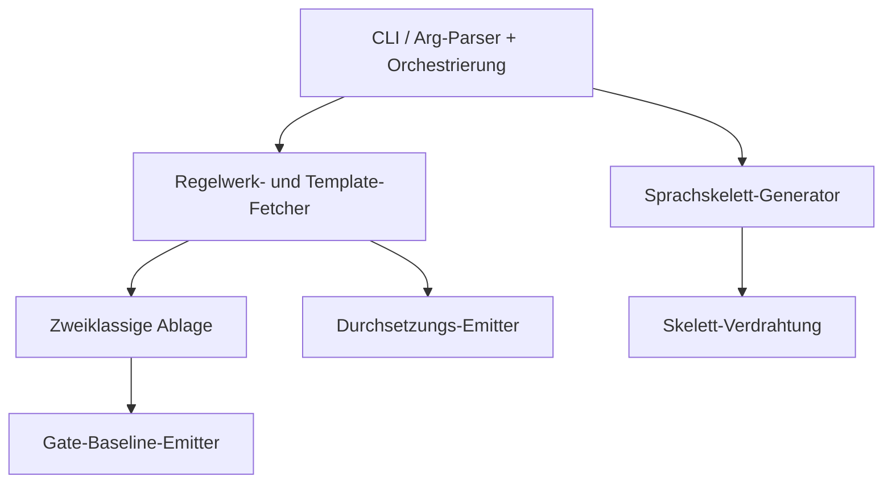
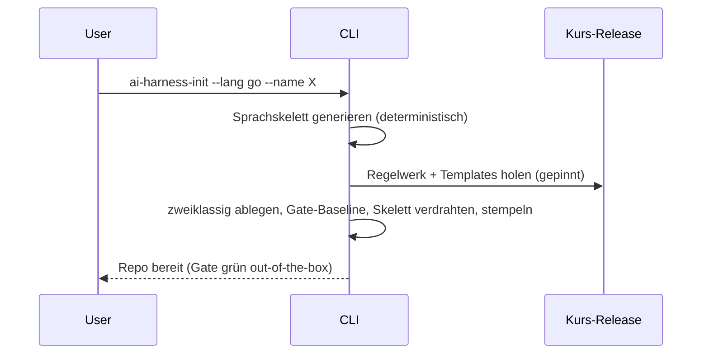

# Architektur — ai-harness-init

**Status:** Aktiv. **Letzte Änderung:** 2026-07-22.

**Hard Rule:** sprach- und meilensteinfrei — keine Wellen, Slices oder
Commit-Hashes. Die zeitliche Schicht lebt in docs/plan/planning/ *(folgt)*.

---

## 1. Komponenten-Übersicht

## 2. Schichten und Constraints

| Schicht | Verantwortung | Darf NICHT |
|---|---|---|
| CLI | Arg-Parsing, Orchestrierung | Dateiinhalte erfinden |
| Fetcher | Regelwerk + Templates vom gepinnten Kurs-Stand holen | floating main nutzen |
| Placer | Templates zweiklassig ablegen | Set-Index-README kopieren |
| Emitter | Gate-Baseline schreiben | Gate ohne existierendes Target aktivieren |
| Generator | Sprachskelett **deterministisch** erzeugen (Tool-als-Quelle) | nicht-reproduzierbare/floating Ausgabe |
| Verdrahtung | Skelett am Ziel-Root platzieren + Doc-Gate einbinden | nicht-laufende Targets emittieren |
| Enforce-Emitter | Stop-Hook/Guard/Skill ins Ziel schreiben | node/jq/OCI als Guard-Dep verlangen |

## 3. Externe Abhängigkeiten

| System | Rolle | Substituierbar |
|---|---|---|
| git | Repo-Init/Checkout | nein |
| docker | d-check-Image-Lauf (Gate) + Tool-Build-Image | nein |
| Go-Toolchain (im gepinnten Build-Image) | Tool-Build / Cross-Compile, Docker-only | nein |
| Kurs-Release (gepinnt) | Regelwerk + Templates (Sprachskelette erzeugt der Generator, kein Fetch) | Tag wählbar |

> Implementierung: **Go**; Auslieferung als **native Binaries** je `GOOS`/`GOARCH`,
> cross-kompiliert im gepinnten Build-Image (Docker-only, kein Host-`go`).

## 4. Ablauf (Sequenz)

