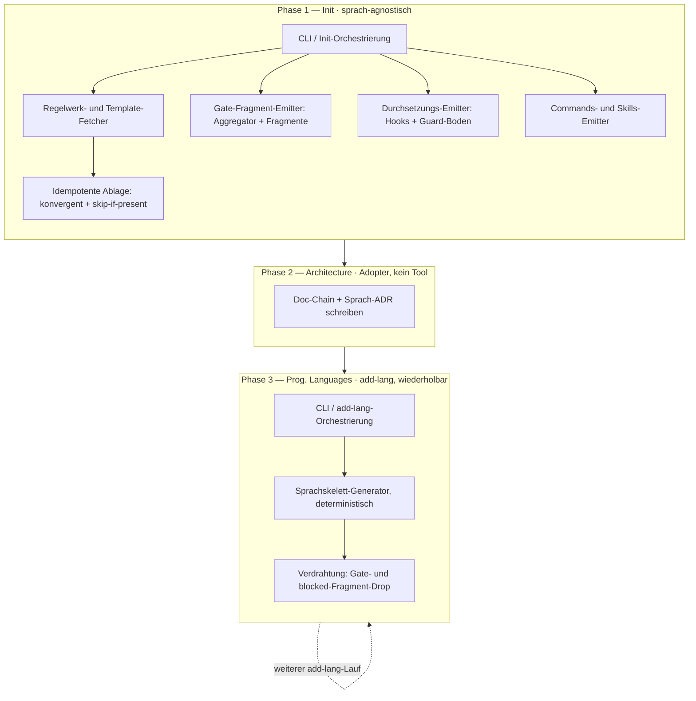
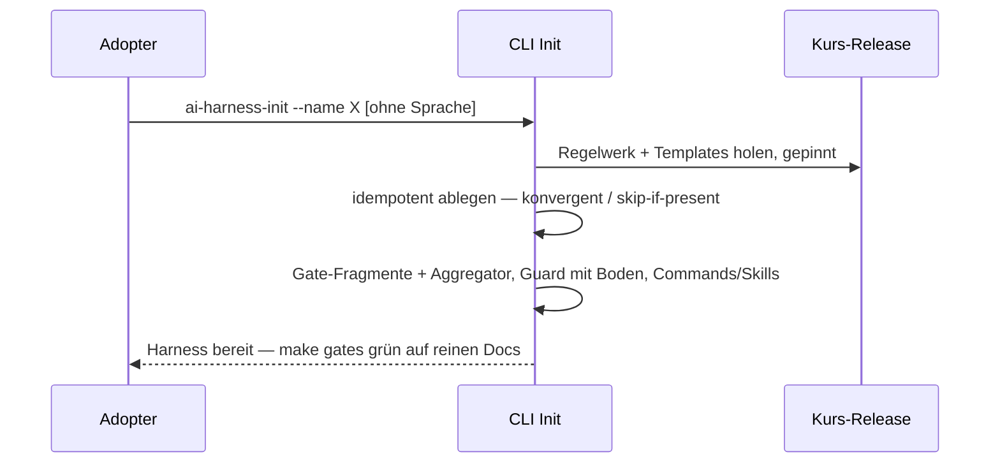
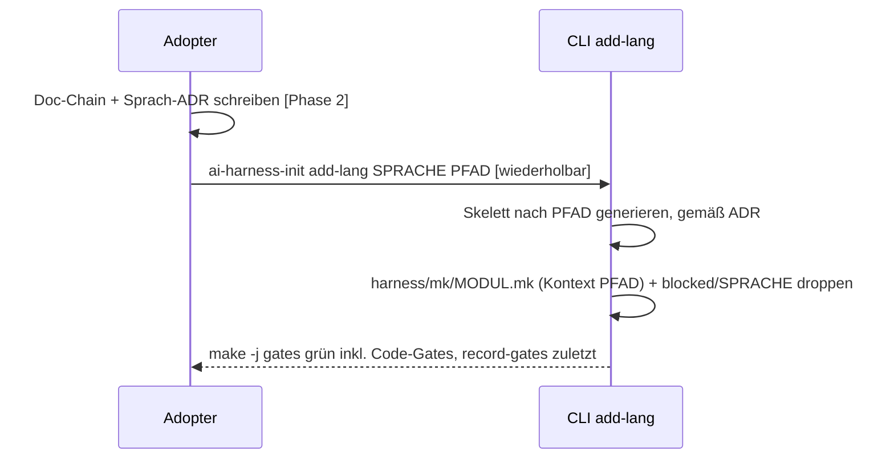

# Architektur — ai-harness-init

**Status:** Aktiv. **Letzte Änderung:** 2026-07-23.

**Hard Rule:** sprach- und meilensteinfrei — keine Wellen, Slices oder
Commit-Hashes. Die zeitliche Schicht lebt in docs/plan/planning/ *(folgt)*.

---

## 1. Komponenten-Übersicht

Der Bootstrap ist **phasiert**: ein sprach-agnostischer **Init** legt die Harness
(Doc-Chain, Durchsetzung, doc-only-Gate) an, der Adopter schreibt seine Doc-Chain
inklusive **Sprach-ADR**, und ein **wiederholbarer** `add-lang`-Schritt generiert je
Sprache/Modul das Skelett samt Code-Gate — die Sprache ist damit eine
Adopter-Entscheidung *nach* der Architektur, kein Init-Argument (Mono-Repo fällt
heraus). Die Sprachwahl im Diagramm ist Ablauf, kein Constraint der Emitter.

## 2. Schichten und Constraints

| Schicht | Verantwortung | Darf NICHT |
|---|---|---|
| CLI | Arg-Parsing (Init + `add-lang`-Subkommando), Phasen-Orchestrierung | Dateiinhalte erfinden; die Sprache beim Init erzwingen |
| Fetcher | Regelwerk **und** Templates vom gepinnten Kurs-Release holen | floating main nutzen |
| Placer | Jede emittierte Datei nach ihrer Idempotenz-Klasse ablegen: **konvergent** schreibt kanonisch (heilt Drift/Baseline-Upgrade), **skip-if-present** lässt Adopter-Inhalt unberührt | Adopter-Inhalt clobbern; ein Verzeichnis prunen; im Zweifel konvergent klassifizieren |
| Gate-Emitter | Root-Makefile als **dünnen Aggregator** (benannter Glob-Include) + Gate-Fragmente je Belang; die Checks akkumulieren in eine Variable, der Nachweis läuft via **Ordnungskante** strikt zuletzt | Gate ohne existierendes Target aktivieren; ein Fragment in-place editieren; `make -j` serialisieren |
| Enforce-Emitter | Durchsetzung (Hooks, Gate-Nachweis, Working-Tree-Hash, Command-Guard mit **gebackenem universellem Boden** + Union der blocked-Fragmente) schreiben | den Guard fail-open lassen (Boden greift immer); node/jq/OCI als Guard-Dep verlangen |
| Commands-/Skills-Emitter | Agenten-Workflow-Commands (mit ANPASSEN-Marker) + Reviewer-Skill ins Ziel schreiben | Repo-Quell-Identität in die Artefakte tragen |
| Generator | Sprachskelett **deterministisch** je `add-lang` erzeugen (Tool-als-Quelle), **gemäß Sprach-ADR** | nicht-reproduzierbare/floating Ausgabe; ohne ADR generieren |
| Verdrahtung | Skelett am Ziel-Root platzieren + Code-Gate-Fragment + Guard-blocked-Fragment **droppen** (kein In-Place-Edit) | nicht-laufende Targets emittieren |

## 3. Externe Abhängigkeiten

| System | Rolle | Substituierbar |
|---|---|---|
| git | Repo-Init/Checkout | nein |
| docker | d-check-Image-Lauf (Gate) + Tool-Build-Image | nein |
| Go-Toolchain (im gepinnten Build-Image) | Tool-Build / Cross-Compile, Docker-only | nein |
| Kurs-Release (gepinnt) | Regelwerk + Templates (Sprachskelette erzeugt der Generator, kein Fetch) | Tag wählbar |

> Implementierung: **Go**; Auslieferung als **native Binaries** je `GOOS`/`GOARCH`,
> cross-kompiliert im gepinnten Build-Image (Docker-only, kein Host-`go`).

## 4. Ablauf (Sequenzen)

### 4.1 Init — sprach-agnostisch

### 4.2 add-lang — wiederholbar, ADR-gegatet

Der Fragment-Name ist **modul-** (nicht sprach-)abgeleitet: `<modul>` kommt aus `<pfad>`
(`apps/api` → `apps-api`, Root → die Sprache), sodass zwei Module derselben Sprache
kollisionsfrei koexistieren. Subdir-Module tragen **modul-scoped** Targets
(`test-<modul>`/`lint-<modul>`/`build-<modul>`, Build-Kontext `<pfad>`); der Root-Fall
(`--lang`-One-Shot, `<pfad>=.`) behält die unscoped `test`/`lint`/`build`
(rückwärtskompatibel). `blocked/<sprache>` ist per-Sprache **konvergent** (tool-fixierter
Inhalt, bei jedem Lauf kanonisch neu — mehrere Module derselben Sprache schreiben es
byte-identisch). `--lang <X>` beim Init ist die One-Shot-Kurzform (Init + ein
`add-lang(<X>, .)`); `emit.Enforce` bleibt dabei sprach-agnostisch.

## 5. Idempotenz, Fragment-Assembly und Resume

- **Idempotenz-Klassifikation je Datei** (nicht je Verzeichnis): tool-eigene
  Infrastruktur (Aggregator, Fragmente, Hooks, Guard, Baseline, Skills) ist
  **konvergent** — ein Re-Lauf schreibt sie kanonisch und **prunt nie**; im Zweifel
  gilt **skip-if-present** (Adopter-Boden: Doc-Chain, ADRs, `README`, `AGENTS`,
  Manifeste, Skelett-Code). So überlebt ein zuvor gedropptes `harness/mk/<modul>.mk`
  oder `blocked/<sprache>` einen sprachlosen Re-Lauf.
- **Fragment-Assembly:** die Root-Makefile ist ein Aggregator mit `include harness/mk/*.mk`;
  jedes Fragment hängt seine Checks an eine Variable (`GATE_CHECKS += …`). Der
  Gate-Nachweis läuft über eine **Ordnungskante** (`record-gates: $(GATE_CHECKS)`)
  strikt nach allen Checks, während `make -j` die Checks parallel fährt —
  `.NOTPARALLEL` ist bewusst nicht gewählt. `add-lang` ist damit ein reiner
  Fragment-Drop, kein In-Place-Edit.
- **Guard-Boden + Union:** der Command-Guard trägt ein universelles BLOCKED-Set
  (apt/pip/npm/cargo) **im Skript gebacken** — er ist nie fail-open, auch bei
  fehlendem `tools/harness/blocked/`. Er liest zusätzlich `tools/harness/blocked/*`
  und **vereinigt** sie (reines bash+`cat`); `add-lang` erweitert die Menge je Sprache
  ohne den Boden zu berühren.
- **Interaktivität optional, nie tragend:** der Kern bleibt flag-getrieben und
  deterministisch (CI headless); ein optionales TTY-Frontend sammelt nur Werte und
  ändert **nie** die Output-Bytes. Next-Step-Hinweise sind Ausgabe, kein Zustand.
- **Resume = idempotenter Re-Lauf:** der Checkpoint ist das Repo selbst (Dateien +
  git); es gibt **kein** Zustandsfile, das als zweite Wahrheit driften könnte.
