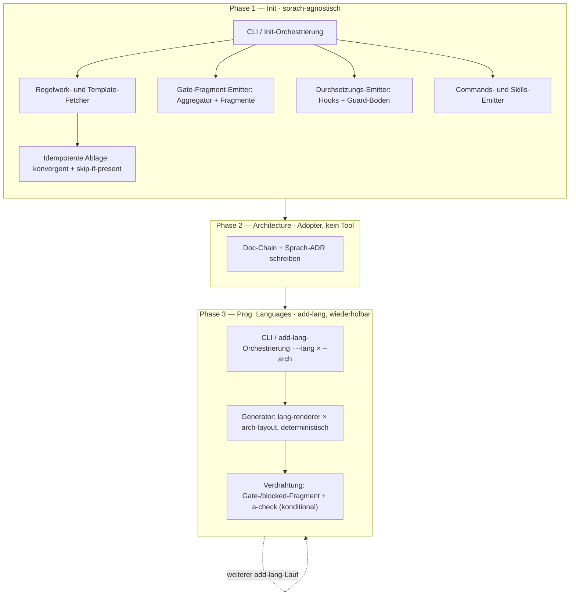
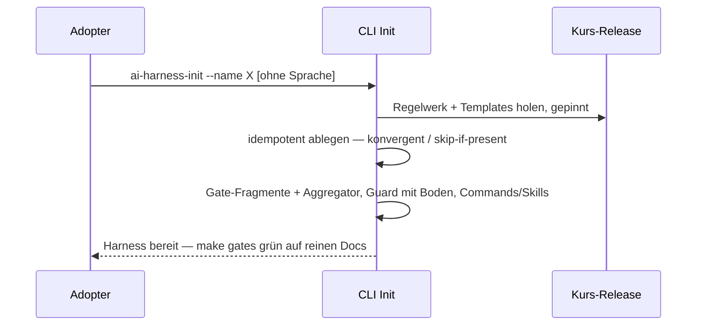

# Architektur — ai-harness-init

**Status:** Aktiv. **Letzte Änderung:** 2026-07-24.

**Hard Rule:** sprach- und meilensteinfrei — keine Wellen, Slices oder
Commit-Hashes. Die zeitliche Schicht lebt in docs/plan/planning/ *(folgt)*.

---

## 1. Komponenten-Übersicht

Der Bootstrap ist **phasiert**: ein sprach-agnostischer **Init** legt die Harness
(Doc-Chain, Durchsetzung, doc-only-Gate) an, der Adopter schreibt seine Doc-Chain
inklusive **Sprach-ADR**, und ein **wiederholbarer** `add-lang`-Schritt generiert je
Sprache/Modul das Skelett samt Code-Gate — die Sprache ist damit eine
Adopter-Entscheidung *nach* der Architektur, kein Init-Argument (Mono-Repo fällt
heraus). Die Sprachwahl im Diagramm ist Ablauf, kein Constraint der Emitter.

Neben der Sprache trägt `add-lang` eine **zweite, parallele Achse — die Architektur**
(`--arch`, Default `flat`, opt-in `hexagonal` = die drei klassischen Schichten oder
`hexslice` = Hexagonal + Vertical Slice): der Generator
**komponiert** `lang-renderer × arch-layout` — die Sprach-Schicht liefert die arch-invariante
Bau-/Toolchain-Gerüstung **plus** einen Rollen-Renderer, die Arch-Schicht das
Code-Layout (welche Rollen in welchen Verzeichnissen). So wächst die Menge **linear
(Sprachen + Architekturen)**, nicht multiplikativ. Ein schichten-tragendes Layout
(`hexagonal`, `hexslice`) gibt dem **Architektur-Gate** (a-check) einen realen Prüfbereich;
es wird **genau dann** emittiert (bei `flat` nicht — kein Gate über leerem Bereich).
Ob ein Layout Schichten trägt, ist eine **strukturelle** Eigenschaft (trägt es eine Rolle,
die weder Entry-Point noch Toolchain-Test noch Composition Root ist?) — **kein** Abgleich
gegen die Verzeichnisnamen eines bestimmten Layouts; sonst verlöre das nächste Layout mit
eigenem Vokabular sein Gate, ohne dass ein Wächter anschlägt.

```mermaid
flowchart TB
    subgraph P1["Phase 1 — Init · sprach-agnostisch"]
        direction TB
        CLI1[CLI / Init-Orchestrierung]
        Fetch[Regelwerk- und Template-Fetcher]
        Place[Idempotente Ablage: konvergent + skip-if-present]
        Gate[Gate-Fragment-Emitter: Aggregator + Fragmente]
        Enforce[Durchsetzungs-Emitter: Hooks + Guard-Boden]
        Emit[Commands- und Skills-Emitter]
        CLI1 --> Fetch
        Fetch --> Place
        CLI1 --> Gate
        CLI1 --> Enforce
        CLI1 --> Emit
    end
    subgraph P2["Phase 2 — Architecture · Adopter, kein Tool"]
        Doc[Doc-Chain + Sprach-ADR schreiben]
    end
    subgraph P3["Phase 3 — Prog. Languages · add-lang, wiederholbar"]
        direction TB
        CLI3["CLI / add-lang-Orchestrierung · --lang × --arch"]
        Gen["Generator: lang-renderer × arch-layout, deterministisch"]
        Wire["Verdrahtung: Gate-/blocked-Fragment + a-check (konditional)"]
        CLI3 --> Gen
        Gen --> Wire
    end
    P1 --> P2
    P2 --> P3
    P3 -. weiterer add-lang-Lauf .-> P3
```

## 2. Schichten und Constraints

| Schicht | Verantwortung | Darf NICHT |
|---|---|---|
| CLI | Arg-Parsing (Init + `add-lang <sprache> <pfad>` mit optionalem `--arch <arch>`), Phasen-Orchestrierung | Dateiinhalte erfinden; die Sprache beim Init erzwingen; unbekannte Architektur still hinnehmen (→ Exit 2) |
| Fetcher | Regelwerk **und** Templates vom gepinnten Kurs-Release holen | floating main nutzen |
| Placer | Jede emittierte Datei nach ihrer Idempotenz-Klasse ablegen: **konvergent** schreibt kanonisch (heilt Drift/Baseline-Upgrade), **skip-if-present** lässt Adopter-Inhalt unberührt | Adopter-Inhalt clobbern; ein Verzeichnis prunen; im Zweifel konvergent klassifizieren |
| Gate-Emitter | Root-Makefile als **dünnen Aggregator** (benannter Glob-Include) + Gate-Fragmente je Belang; die Checks akkumulieren in eine Variable, der Nachweis läuft via **Ordnungskante** strikt zuletzt | Gate ohne existierendes Target aktivieren; ein Fragment in-place editieren; `make -j` serialisieren |
| Enforce-Emitter | Durchsetzung (Hooks, Gate-Nachweis, Working-Tree-Hash, Command-Guard mit **gebackenem universellem Boden** + Union der blocked-Fragmente) schreiben | den Guard fail-open lassen (Boden greift immer); node/jq/OCI als Guard-Dep verlangen |
| Commands-/Skills-Emitter | Agenten-Workflow-Commands (mit ANPASSEN-Marker) + Reviewer-Skill ins Ziel schreiben | Repo-Quell-Identität in die Artefakte tragen |
| Generator | Skelett **deterministisch** je `add-lang` erzeugen (Tool-als-Quelle), **gemäß ADR**; **`lang-renderer × arch-layout` komponieren** — arch-invariante Bau-Gerüstung + arch-gegatetes Code-Layout (`flat` byte-identisch zum heutigen Skelett, `hexslice` = `domain`/`application` (Use-Case-Slices)/`ports`/`adapters` + Composition Root `cmd/`, `hexagonal` = `core`/`port`/`driven`/`driving` + Composition Root `cmd/`) | nicht-reproduzierbare/floating Ausgabe; ohne ADR generieren; die Bau-Gerüstung an die Architektur koppeln (sie ist arch-invariant); zwei Layouts zu einem mit zwei Kanten-Mengen verschmelzen (ihre Verzeichnisnamen sind disjunkt) |
| Verdrahtung | Skelett am Ziel-Root platzieren + Code-Gate-Fragment + Guard-blocked-Fragment **droppen** (kein In-Place-Edit); das **a-check-Fragment (`.a-check.yml` + `a-check.mk`) nur bei schichten-tragendem Layout** droppen | nicht-laufende Targets emittieren; a-check über einem flachen (leeren) Prüfbereich aktivieren |

## 3. Externe Abhängigkeiten

| System | Rolle | Substituierbar |
|---|---|---|
| git | Repo-Init/Checkout | nein |
| docker | d-check-Image-Lauf (Gate) + Tool-Build-Image | nein |
| Go-Toolchain (im gepinnten Build-Image) | Tool-Build / Cross-Compile, Docker-only | nein |
| Kurs-Release (gepinnt) | Regelwerk + Templates (Sprachskelette erzeugt der Generator, kein Fetch) | Tag wählbar |

> Implementierung: **Go**; Auslieferung als **native Binaries** je `GOOS`/`GOARCH`,
> cross-kompiliert im gepinnten Build-Image (Docker-only, kein Host-`go`).

## 4. Ablauf (Sequenzen)

### 4.1 Init — sprach-agnostisch

```mermaid
sequenceDiagram
    participant U as Adopter
    participant C as CLI Init
    participant R as Kurs-Release
    U->>C: ai-harness-init --name X   [ohne Sprache]
    C->>R: Regelwerk + Templates holen, gepinnt
    C->>C: idempotent ablegen — konvergent / skip-if-present
    C->>C: Gate-Fragmente + Aggregator, Guard mit Boden, Commands/Skills
    C-->>U: Harness bereit — make gates grün auf reinen Docs
```

### 4.2 add-lang — wiederholbar, ADR-gegatet

```mermaid
sequenceDiagram
    participant U as Adopter
    participant C as CLI add-lang
    U->>U: Doc-Chain + Sprach-/Architektur-ADR schreiben  [Phase 2]
    U->>C: ai-harness-init add-lang SPRACHE PFAD [--arch ARCH]   [wiederholbar]
    C->>C: Skelett nach PFAD generieren — lang-renderer × arch-layout, gemäß ADR
    C->>C: harness/mk/MODUL.mk + blocked/SPRACHE droppen; a-check-Fragment NUR bei hexslice
    C-->>U: make -j gates grün inkl. Code-Gates (+ a-check bei hexslice), record-gates zuletzt
```

Der Fragment-Name ist **modul-** (nicht sprach-)abgeleitet: `<modul>` kommt aus `<pfad>`
(`apps/api` → `apps-api`, Root → die Sprache), sodass zwei Module derselben Sprache
kollisionsfrei koexistieren. Subdir-Module tragen **modul-scoped** Targets
(`test-<modul>`/`lint-<modul>`/`build-<modul>`, Build-Kontext `<pfad>`); der Root-Fall
(`--lang`-One-Shot, `<pfad>=.`) behält die unscoped `test`/`lint`/`build`
(rückwärtskompatibel). `blocked/<sprache>` ist per-Sprache **konvergent** (tool-fixierter
Inhalt, bei jedem Lauf kanonisch neu — mehrere Module derselben Sprache schreiben es
byte-identisch). `--lang <X>` beim Init ist die One-Shot-Kurzform (Init + ein
`add-lang(<X>, .)`); `emit.Enforce` bleibt dabei sprach-agnostisch.

## 5. Idempotenz, Fragment-Assembly und Resume

- **Idempotenz-Klassifikation je Datei** (nicht je Verzeichnis): tool-eigene
  Infrastruktur (Aggregator, Fragmente, Hooks, Guard, Baseline, Skills) ist
  **konvergent** — ein Re-Lauf schreibt sie kanonisch und **prunt nie**; im Zweifel
  gilt **skip-if-present** (Adopter-Boden: Doc-Chain, ADRs, `README`, `AGENTS`,
  Manifeste, Skelett-Code). So überlebt ein zuvor gedropptes `harness/mk/<modul>.mk`
  oder `blocked/<sprache>` einen sprachlosen Re-Lauf.
- **Fragment-Assembly:** die Root-Makefile ist ein Aggregator mit `include harness/mk/*.mk`;
  jedes Fragment hängt seine Checks an eine Variable (`GATE_CHECKS += …`). Der
  Gate-Nachweis läuft über eine **Ordnungskante** (`record-gates: $(GATE_CHECKS)`)
  strikt nach allen Checks, während `make -j` die Checks parallel fährt —
  `.NOTPARALLEL` ist bewusst nicht gewählt. `add-lang` ist damit ein reiner
  Fragment-Drop, kein In-Place-Edit.
- **Architektur-Achse und konditionale a-check-Emission:** der Generator komponiert
  `lang-renderer × arch-layout` — die **Bau-/Toolchain-Gerüstung** (Dockerfile-Stages,
  Manifeste, Lint-Config) ist **arch-invariant** und immer präsent (sonst bräche der
  Code-Gate-Lauf), das **Code-Layout** ist arch-gegatet (`flat` = ein Entry-Point wie
  heute; `hexslice` = `domain`/`application` (Use-Case-Slices mit
  `command`/`handler`/`validator`/`result`/`ports`)/`ports`/`adapters` (`inbound`/`outbound`)
  + Composition Root `cmd/`, samt Tests je Schicht). Die a-check-Config bildet diese
  Schichten ab: vier Layer (`domain`/`app`/`ports`/`adapters`), inward-only-Kanten
  (`app→domain`, `app→ports`, `ports→domain`, `adapters→app`, `adapters→domain`) und
  `cmd/**` als Composition Root (a-check-exempt, verdrahtet die Ports strukturell). Das
  **Architektur-Gate** (a-check, per-Tool-Fragment wie das Doc-Gate) wird **nur bei
  einem schichten-tragenden Layout** emittiert; bei `flat` liegt kein `.a-check.yml`/
  `a-check.mk` im Ziel — kein Gate über leerem Prüfbereich. Idempotenz-Klassen wie beim
  Doc-Gate: `a-check.mk` (+ Aggregator-Anschluss) **konvergent**, `.a-check.yml`
  **skip-if-present** (der Adopter passt die Schicht-Config an). Voraussetzung der
  a-check-Emission ist die Verfügbarkeit des a-check-Tools (gepinntes Image mit
  `--print-mk`, real ab v0.15.0) — dieselbe Tool-als-Quelle-Linie wie d-check.
- **Ein zweites schichten-tragendes Layout: `hexagonal`.** Es ist **kein Strenge-Grad**
  von `hexslice`, sondern ein eigenes Layout mit **disjunkten** Verzeichnisnamen: ein Kern
  (`core` — Domäne **und** Use-Case in *einer* geprüften Schicht, Rolle `app`), eine
  **importfreie** Port-Schicht (`port`), getriebene und treibende Adapter (`driven`,
  `driving` — beide Rolle `adapter`) und der Composition Root `cmd/`. Die Kanten sind
  `core→ports`, `driven→ports`, `driven→core`, `driving→core`; **`ports→core` fehlt**,
  weil es zusammen mit `core→ports` in einer einzigen Kern-Schicht ein Import-Zyklus wäre
  — die Zielsprache schlösse das Skelett aus, nicht erst das Gate. Jede Schicht deklariert
  ihre Rolle **explizit** (die Namens-Inferenz des Gates kennt `driven`/`driving` nicht),
  denn Rollen schalten die **kategorischen** Regeln, die keine Kante aufhebt:
  `app-impurity` (der Kern sieht keinen Adapter) und `lateral-adapter` (zwei
  Adapter-Schichten sehen einander nie — die tragende Regel dieses Layouts, und eben
  *keine* Kante). Die treibende Seite ist damit eine **geprüfte Schicht**; wer sie
  prüffrei will, trägt sie in seinem eigenen `composition_root` ein — die Config ist
  skip-if-present, also seine Datei. Die emittierten Pfade folgen bewusst der **gelebten
  Konvention** der Werkzeug-Familie und nicht der Standardform, die das Gate selbst
  vorschlägt. Die Regel dahinter — *bei unbekannten Adoptern ist der Default fail-closed,
  laut falsch schlägt leise falsch* — gilt für **jeden** emittierten Prüfbereich
  ([`MR-017`](../harness/conventions.md#mr-017--default-regel-für-emittierte-prüfbereiche-fail-closed)).
  Die Verdrahtung liegt im Composition Root und trägt dort **nur Konstruktion**: die
  Use-Case bleibt im Kern, sonst wanderte Logik in den einzigen ungeprüften Bereich.
- **Was das Arch-Gate sehen kann, bestimmt das Layout — nicht umgekehrt.** a-check
  löst **nur modul-root-relative** Referenz-Strings auf. Ein Sprach-Renderer, dessen
  Schicht-Dateien einander relativ oder über einen verkürzten Pfad referenzieren, baut
  ein Layout, das **übersetzt, aber unsichtbar ist**: das Gate meldet dann 0 Befunde über
  einer real verletzten Schichtung — ein stilles Grün. Verbindlich ist daher: die
  Referenzen zwischen Schicht-Dateien sind **modul-root-relativ**, und die
  Bau-Gerüstung trägt das Minimum, das diese Form auflösbar **und** prüfbar macht
  (bei C++ den Modul-Root im Include-Pfad und ein Header-Filter-Muster, das die
  Schicht-Header erreicht — beides für ein flaches Layout wirkungslos). Belegt wird das
  nicht durch Zusicherung, sondern durch zwei Gegenbeispiele im Voll-E2E-Smoke: ein
  Fehler in einer Schicht-Datei muss den Modul-**Build** röten, ein Lint-Verstoß darin
  den **Lint**-Gate.
- **Die Kanten-Menge ist sprach-abhängig, das Layout nicht.** Wie ein Outbound-Adapter
  seinen Port erfüllt, entscheidet die Sprache: **strukturell** (Go: Interface-Erfüllung
  ohne Import → keine `adapters→ports`-Kante) oder **durch Vererbung** (C++: der Adapter
  bindet den Port-Header ein → die Kante ist **erforderlich**). Die a-check-Config eines
  Sprach-Renderers bildet dessen reale Erfüllungs-Form ab; eine Kante aus einer anderen
  Sprache zu übernehmen oder zu streichen, färbt das Gate des generierten Skeletts rot.
  Das Schicht-Layout selbst bleibt über alle Sprachen dasselbe.
- **Ein ausführbares Artefakt, und eine Klasse außerhalb des versionierten Baums.** Die
  Emission legt nicht nur Text ab: der **Träger** der Erfassung ist das laufende
  Produkt-Binär selbst, kopiert in den gitignorierten Zustands-Bereich des Ziels
  (`.harness/state/`). Er ist **konvergent** und wird **nie geprunt**, steht aber in
  keiner Emit-Pfad-Liste — sein Ort liegt außerhalb des versionierten Baums, und der
  Gate-Nachweis des Ziels listet mit `--exclude-standard` und bleibt von ihm unberührt.
  Der Hook zeigt **nicht** auf ihn, sondern auf einen **committeten Wrapper** unter
  `.claude/hooks/`, konvergent wie die übrigen Hook-Skripte: ein frischer Klon des
  Adopter-Repos trägt den gitignorierten Träger nicht, und eine Konfiguration, die
  direkt auf ihn zeigte, wäre ein Hook auf ein fehlendes Programm
  ([`LH-QA-01`](lastenheft.md#lh-qa-01--keine-halluzinierten-gates-f4-f5-f6)) — nur
  zeitversetzt. Der Wrapper schweigt und endet erfolgreich, wenn der Träger fehlt.
- **Der kanonische Inhalt einer konvergenten Datei hängt hier erstmals an einem
  Laufzeit-Ausgang.** Träger, Wrapper und der Erfassungs-Block in
  `.claude/settings.json` entstehen **gemeinsam oder gar nicht**: scheitert die Ablage
  des Trägers, wird keiner der drei geschrieben, der Bootstrap nennt den Grund und endet
  erfolgreich, und das Ziel ist ohne Erfassung vollständig
  ([`LH-FA-10`](lastenheft.md#lh-fa-10--erfassungsschicht-emittieren)). Ein Re-Lauf, der
  den Block nicht setzen kann, schreibt die Datei ohne ihn — die Konfiguration
  beschreibt die Wirklichkeit, und das ist Konvergenz, kein Prune. Zwei Läufe
  **derselben** Tool-Version erzeugen deshalb verschiedene Bytes, wenn die Ablage beim
  einen gelingt und beim anderen nicht:
  [`LH-QA-02`](lastenheft.md#lh-qa-02--reproduzierbarkeit) bindet sie damit an Version
  **und** Ausgang, nicht an die Version allein.
- **Guard-Boden + Union:** der Command-Guard trägt ein universelles BLOCKED-Set
  (apt/pip/npm/cargo) **im Skript gebacken** — er ist nie fail-open, auch bei
  fehlendem `tools/harness/blocked/`. Er liest zusätzlich `tools/harness/blocked/*`
  und **vereinigt** sie (reines bash+`cat`); `add-lang` erweitert die Menge je Sprache
  ohne den Boden zu berühren.
- **Interaktivität optional, nie tragend:** der Kern bleibt flag-getrieben und
  deterministisch (CI headless); ein optionales TTY-Frontend sammelt nur Werte und
  ändert **nie** die Output-Bytes. Next-Step-Hinweise sind Ausgabe, kein Zustand.
- **Resume = idempotenter Re-Lauf:** der Checkpoint ist das Repo selbst (Dateien +
  git); es gibt **kein** Zustandsfile, das als zweite Wahrheit driften könnte.
